Editores y constructores
========================

**Recopilado por**: José Joaquín Vasquez y José Navarro Camareno

Edición en el sitio
-------------------

Este patrón de edición permite que el usuario tenga la posibilidad de
modificar texto dinámicamente por medio de un mini editor de texto que
se activa sobre el texto original para poder ser editado en el mismo
lugar en el que se encuentra el texto, "en el sitio" evitando editores
emergentes o incluso otras ventanas de edición.

La edición en el sitio funciona básicamente dando doble click sobre el
texto que se desea editar, el cual va responder con un editor de texto
que contiene el texto original sobre el cual se presionó, con el fin de
poder editar ese texto. Para terminar la edición basta con presionar
algún lugar fuera del editor de texto.

Ventajas:
~~~~~~~~~

Esto permite que el usuario tenga mayor agilidad y flexibilidad para
tener acceso a la edición de los datos. El hacer que el usuario no vaya
a otro lugar para editar el texto original es una gran ventaja ya que
reduce la percepción de una interface complicada al no desviar su
atención en otros lugares; sino que mantiene el flujo de visión de
trabajo de la aplicación.

Desventajas:
~~~~~~~~~~~~

Un posible inconveniente que puede presentar este patrón de edición en
el sitio es que si el usuario no está familiarizado con el patrón, no
tendrá la noción de que puede editar el contenido que está teniendo
acceso; además de esto para algunos casos en los que el texto es muy
complejo o con cierta justificación se le puede dificultar el marcado de
un una palabra en particular (esto para usuarios con poca precisión).

Ejemplos
~~~~~~~~

-  Las aplicaciones de desarrollo incorporadas en los navegadores web
   permiten editar los campos de texto o valores de cada etiqueta de
   html incluidos en la hoja de hipertexto presionando doble click sobre
   el valor que se desea modificar haciendo uso del patrón edición en el
   sitio.

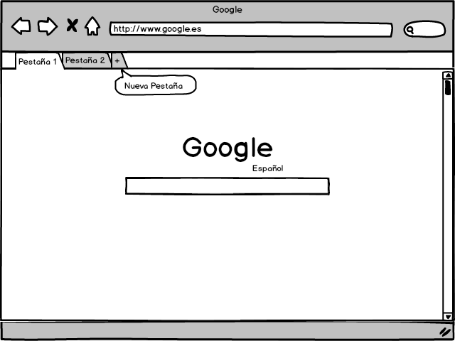

-  Cuando se quiere renombrar una carpeta o archivo al presionar el
   click sobre el archivo dos veces con cierta diferencia permite la
   edición del nombre del archivo en un mini editor que al abrir aparece
   el nombre original del archivo sobre el texto.

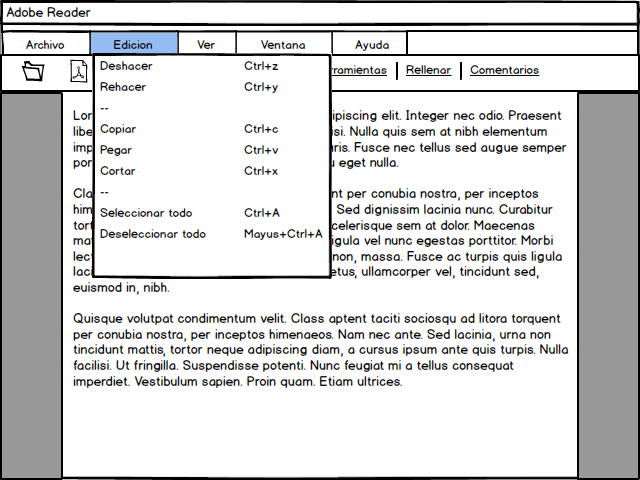

Selección inteligente
---------------------

La selección inteligente consiste en la capacidad del software para
poder agrupar un grupo de objetos seleccionables de manera inteligente
sin la necesidad de intervención del usuario. La selección puede ser
desde un conjunto muy pequeño de pixeles hasta una pagina entera de
texto que el software agrupa según un criterio ya preestablecido por el
desarrollador.

La selección inteligente funciona a través del click mantenido y el
arrastre del mouse sobre los textos que se desean seleccionar, el
software decide que agregar a su selección y marcarlo pintando los
pixeles que rodean el objeto de un color representativo que generalmente
es azul.

    Mouse Clic sostenido y arrastre por el espacio o texto.

Otra forma de poner en acción este patrón es presionando doble click
sobre un espacio en un texto para que automáticamente se selecciones la
palabra o un conjunto de caracteres que se encontraba en ese punto.

Otro método es la utilización del teclado a través de la tecla shift que
permite seleccionar un texto de un punto a otro con ayuda del mouse y la
tecla presionada.

    Shift sostenido + Mouse Clic de un punto a otro

Ventajas
~~~~~~~~

Este permite al usuario agilizar la producción y la manipulación de
datos después de mucho tiempo de practica con el mouse. Ademas permite
la agrupación selectiva que da mayor precisión al usuario al desarrollar
algún proyecto.

Desventajas
~~~~~~~~~~~

Uno de los mayores inconvenientes que presenta es que el usuario debe
tener un cierto grado de precisión para seleccionar los ítems por lo que
en algunos casos se torna complicado para el usuario especialmente si
este es un usuario casual.

Ejemplos
~~~~~~~~

-  Aplicaciones que permiten insertar grupos de imágenes y texto
   combinados, también permiten la selección múltiple de los mismos.

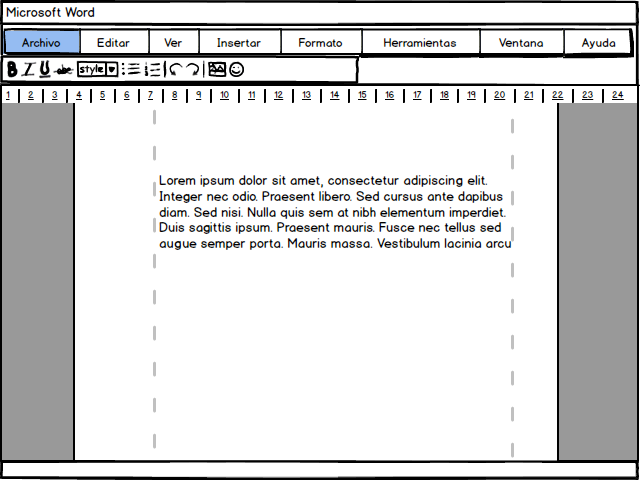

-  La selección de archivos (continuos o discontinuos) en una ventana
   del explorador que provee el sistema operativo.

-  Cualquier texto habilitado para la selección de documentos
   previamente generados.

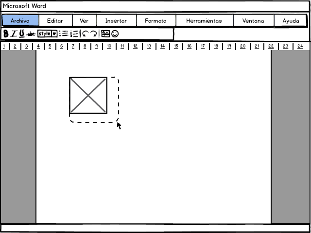

Selección compuesta
-------------------

La selección compuesta permite determinar una selección de un objeto
compuesto o alguno de los elementos que conforman ese objeto. A través
de los click y según el lugar que se ha seleccionado el software
determina si se selecciona el objeto en conjunto o alguno de sus
elementos internos. Suele ser común la manipulación de este tipo de
objetos en programas para desarrollo de interfaces y programas para
dibujo.

Este funciona básicamente al hacer click sobre el objeto compuesto y
según el punto de la pantalla que se haya seleccionado, el programa
determina si se hace la selección del objeto en conjunto o el elemento
interno que se intersecte con ese punto seleccionado. Esto se determina
generalmente si el usuario selecciona el borde o el interior del objeto,
así si se selecciona el interior seleccionará el objeto interno que
coincida en ese punto y si se selecciona el borde del objeto compuesto
seleccionará todo el objeto.

Ventajas
~~~~~~~~

La principal ventaja de este patrón es que permite la fácil manipulación
de objetos compuestos y a su ves la fácil edición de objetos
individuales que forman parte de un objeto compuesto sin necesidad de
separar ese objeto.

Desventajas
~~~~~~~~~~~

Una de las mayores desventajas de este patron es la precisión que deben
poseer las personas que manipulan este tipo de programas, la cual debe
ser muy alta por lo que para un usuario inexperto sería muy difícil
poder utilizar este tipo de herramientas.

Ejemplos
~~~~~~~~

-  La selección de elementos agrupados en editores gráficos como u
   conjunto de imágenes agrupadas y tener la posibilidad de seleccionar
   una sola de las imágenes o todas en conjunto.

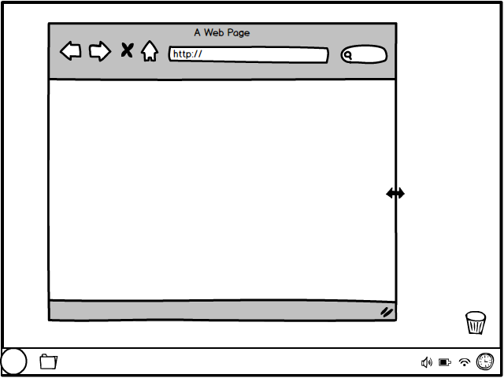

-  La selección de elementos de Balsamiq Mockups en el cual se puede
   seleccionar un elemento como conjunto o un elemento simple.

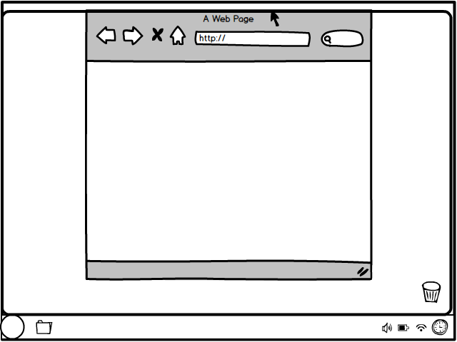

Modo de una sola vez
--------------------

El método de una sola vez consiste en activar una función por medio de
un panel de botones o similares para crear un objeto que no se crea
constantemente con lo que el editor vuelve a su estado previo a la
activación del botón inmediatamente creado el objeto. Esto se debe a que
un usuario generalmente no realiza iteraciones constantes sobre una
función de construcción si no que toma control sobre el objeto creado
para manipularlo a su antojo.

Ventajas
~~~~~~~~

Una gran ventaja de la realización automática de este proceso es evitar
que el usuario deba manualmente intercambiar entre las funciones después
de haber utilizado un constructor. En la mayoría de los casos resulta
fastidioso y lento estar cambiando de funcionalidad para realizar una
operación diferente y el hecho de que el editor identifique que no se
usa con mucha frecuencia una operación hace una experiencia muy amena
para el usuario. Ademas en muchos casos estar subiendo o buscando el
ultimo estado e incluso identificarlo puede resultar difícil para el
usuario.

Desventajas
~~~~~~~~~~~

Una desventaja es que depende meramente de lo que el usuario haga con
frecuencia para determinar que función debe cumplir con este patrón, por
lo que seria contradictorio decir que la función "X" sea mas necesaria
para un usuario en comparación con otro, por lo tanto no se puede
determinar con facilidad a que función se debe aplicar el modo de una
sola vez.

Ejemplos
~~~~~~~~

-  En un editor gráfico cuando se desea crear un dibujo con una figura,
   al seleccionar la figura el puntero del mouse se cambia a modo "drag
   and drop" y el usuario puede escoger el tamaño y pintar esa figura
   deslizando el mouse con el botón click presionado de un punto a otro
   y luego de haber realizado la acción sobre el canvas o lienzo,
   automáticamente el programa vuelve a poner el puntero del mouse en
   modo de selección.

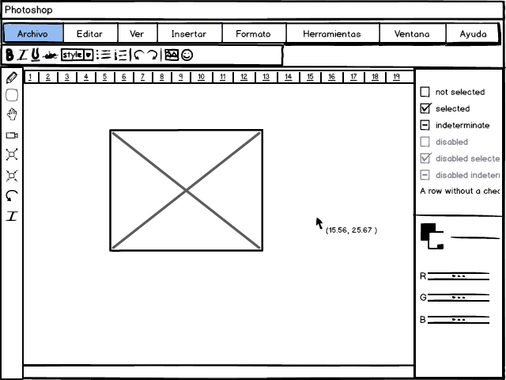

-  En un editor de texto crear un objeto de tipo figura cumple una
   función similar a la descrita anteriormente.

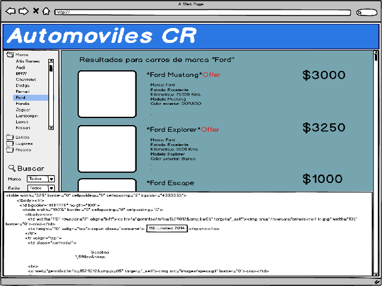

Modo activado temporalmente
---------------------------

Este modo consiste en que el usuario ejecute o pueda ejecutar ciertas
acciones mientras presiona una o más combinaciones de teclas; una vez
que el usuario deja de presionarlas el sistema o ventana vuelve a su
estado previo. Este modo nace de la necesidad de los usuarios de
ejecutar acciones de forma rápida por necesidades de tiempo, trabajo,
efectividad y eficiencia, siendo los modos temporales facilitadores de
la interacción entre este y el computador; estas necesidades se ven
incrementadas si el usuario en cuestión es un usuario permanente del
software y por ende más efectivo se vuelve este modo en el cual el
usuario memorizara las combinaciones o accesos rápidos a estos modos.

Características:
~~~~~~~~~~~~~~~~

La principal característica que debe cumplir este patrón es que las
combinaciones de teclas deben ser sencillas de memorizar (de ser posible
no más de la combinación de 3 teclas) y que sean combinaciones posibles
de realizar en su mayoría con una única mano (preferiblemente mano
izquierda), para dar independencia a la mano que maneja el cursor o
mouse y asi no intervenir de manera directa en el uso del sistema.

Ventajas:
~~~~~~~~~

Una de las ventajas que tiene este modo respecto a otros modos
operacionales es que al ser una acción ejecutada de forma física por el
usuario (presionando teclas o combinaciones de estas), no hay forma que
este olvide que ha cambiado de modo por lo que se evitan errores en este
punto y así se evita retrasos en la ejecución del trabajo del usuario.
Otra de las ventajas de este modo o mecanismo es que reduce el número de
veces que el usuario tiene que buscar una acción ya sea en algún menú,
paleta, lista, etc.

Desventajas
~~~~~~~~~~~

La principal desventaja de este modo es que es puede ser poco visible o
invisible en algunos casos en los que no existe en la interfaz alguna
forma de informar al usuario de estos, por lo que el usuario debe
aprenderlos en la marcha, ir directamente al manual de usuario del
software o aprenderlo por medio de otras personas. De igual forma que en
el modo de una sola vez, es difícil elegir a que acciones asignar un
modo temporal, ya que puede diferir mucho dependiendo del usuario, en
especial si el software es muy complejo y permite interacciones en
distintas áreas.

Ejemplos
~~~~~~~~

-  Algunas aplicaciones de edición de texto posen el modo temporal para
   seleccionar todo el texto mediante la combinación de teclas y además
   de esto luego habilita otros métodos temporales sobre la acción
   realizada al ejecutar la acción anterior:

    Ctrl + A

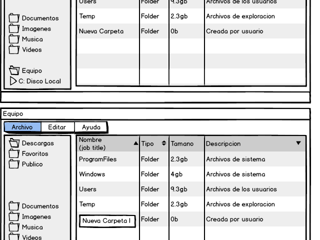

-  Algunos exploradores de Internet permite al usuario tener varias
   páginas abiertas en una misma ventana, mediante el uso de pestañas
   las cuales pueden ser creadas mediante un clic o mediante la
   combinación de teclas:

    Ctrl + T

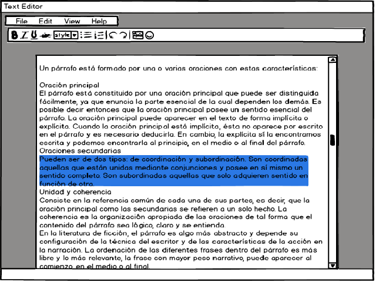

Modificación restringida
------------------------

Esta técnica se base mucho en la usabilidad del software, ya que su meta
es ahorrarle al usuario gran cantidad de trabajo permitiéndole enfocar
la mayor parte del tiempo en ver como lucen los objetos. La técnica
busca que el sistema permita tener operaciones o formas fáciles de
cambiar el tamaño a los objetos manteniendo proporciones de los mismos o
cambiar su tamaño bajo ciertas situaciones o circunstancias.

Ventajas:
~~~~~~~~~

Permite que el flujo de visión sobre la aplicación sea fluido para el
usuario, y los cambios que este realiza se vean reflejados de forma
inmediata sobre la vista del área de trabajo.

Desventajas
~~~~~~~~~~~

Una de las soluciones planteadas en algunos programas, es editar las
propiedades de la imagen o texto mediante formularios en los cuales se
digitan números y esto hace referencia a alguna propiedad del mismo;
pero esta forma no es lo ideal ya que induce al usuario a pensar
matemáticamente y no de forma visual, además de que interrumpe el flujo
de visión de la aplicación quitándole al usuario de ver los cambios de
forma más notoria sobre la imagen o texto.

Ejemplos
~~~~~~~~

-  Aplicaciones que permiten al usuario re dimensionar el tamaño de las
   imágenes sin perder la proporciones de la misma halando con el mouse
   una de las esquinas de la misma hasta lograr el tamaño deseado y
   donde la imagen aun conserve un buen aspecto, sin perder de vista el
   aspecto de la misma logrando ver el resultado final.

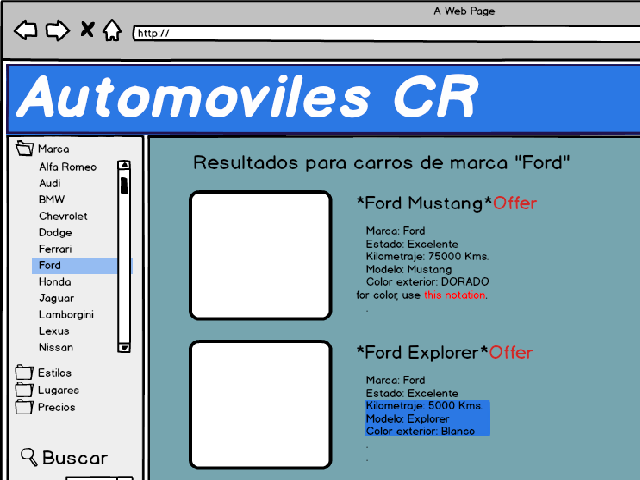

-  Algunos gestores de ventanas de sistemas operativos permiten escalar
   o redimensionar las ventanas de las aplicaciones a un tamaño a gusto
   del usuario.

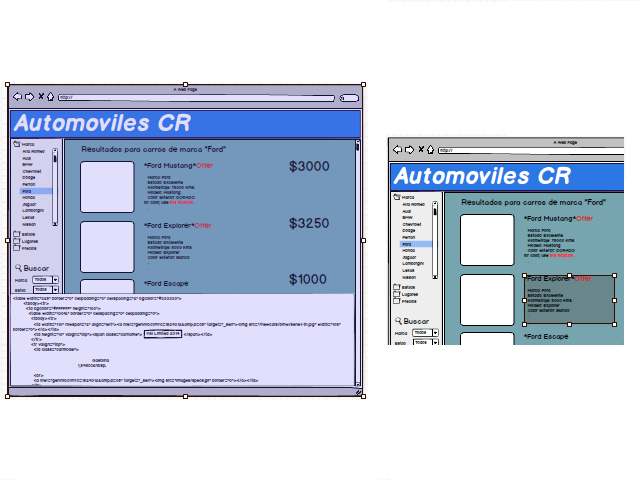

Magnetismo
----------

Esta técnica consiste en el ajuste automático de los objetos hacia un
punto de interacción conocido como "imán". Uno de los usos más comunes
de esta técnica es cuando el usuario arrastra un objeto de la interfaz a
algún punto en particular o hacia otro objeto, este objeto que está
siendo arrastrado al pasar cerca del otro se une o adhiere a él
simulando el comportamiento de un imán.

Esta técnica es muy utilizada en software de edición gráficos además del
manejo de ventanas ya que permite una rápida realización de lo deseado
(bajo heurísticas del mismo software y distintos usos).

Ventajas
~~~~~~~~

El uso del mouse se torna complicado para muchas personas y más si este
se usa bajo entornos de mucha precisión como lo es el campo del diseño;
una gran ventaja y la cual es una de los objetivos que busca este
patrón, es ayudar a los usuarios con poca precisión a realizar ciertas
tareas.

Desventajas
~~~~~~~~~~~

En la mayoría de situaciones este patrón actúa bajo heurísticas
avanzadas y el comportamiento o uso de usuarios semi-expertos o expertos
en el uso del software, por lo que hay situaciones en las cuales actúa o
realiza una acción la cual no era la deseada en ese momento, lo cual se
puede tornar incómodo y tedioso para algunos usuarios que buscan un
resultado distinto, por lo que usuarios con poca experiencia en el
software van a requerir más tiempo en lograr sus objetivos aumentando la
curva de usabilidad del software.

Ejemplos
~~~~~~~~

-  Algunos gestores de ventanas utilizan magnetismo para maximizar las
   ventanas o hacer que esta se ajuste a una posición especifica en la
   pantalla (media pantalla).

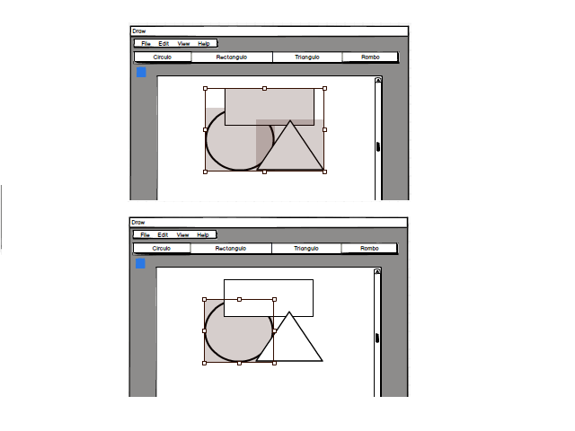

Guías
-----

Consiste en tener líneas horizontales y verticales con forma de cinta
métrica, la cual ayuda al usuario a saber la ubicación de un objeto en
la interfaz, este elemento solo debe informar al usuario de la ubicación
de los objetos y no permitir editar o moverlos, ya que de esa función se
encargan las herramientas de alineamiento las cuales están diseñadas
para actuar de forma rápida y resolver cualquier tipo de situación por
más compleja que sea.

Este elemento también es utilizado en muchas aplicaciones de manejo de
versiones o aplicaciones en las que usuarios trabajan sobre un mismo
objeto de manera simultánea permitiendo identificar la disposición de
los cambios hechos por uno de los miembros.

En el momento de utilizarla se debe tener en cuenta que este elemento no
es parte de los objetos tratados por el usuario, sino una ayuda para
este, por lo que debe ser legible y debe tener una apariencia que lo
distinga de los elementos que trata el usuario. Otra aspecto que se debe
tener en cuenta al utilizarlo es que el usuario puede disponer o no de
ellas y a su vez puede elegir su posición, tamaño, etc. por lo que deben
ser ajustables según la demanda del usuario.

Ejemplos
~~~~~~~~

-  Guías utilizadas en los editores de texto para mostrar la ubicación
   donde se ubica una imagen o párrafo, así mismo la sangría y demás
   aspectos.

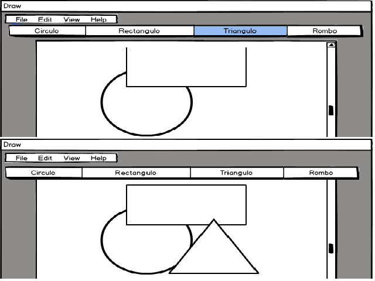

-  Guías utilizadas en editores de imágenes en los cuales mediante una
   representación de coordenadas se le informa al usuario de donde se
   ubica el mouse y de donde parte un objeto (imagen, texto, etc.)

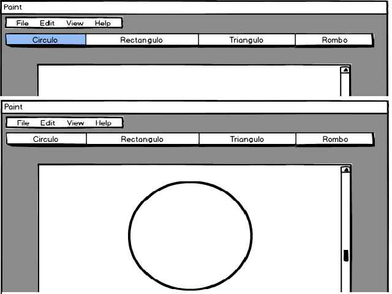

Bibliografia
------------

-  Johnson, J. (2010). Designing with the Mind in Mind. USA: Elsevier.

-  Rolf Molich, J. N. (1990). Improving a HumanComputer. USA:
   Communications of the ACM.

-  Saffer, D. (2010). Designing for Interaction. USA: New Riders.

-  Tidwell, J. (2010). Designing Interfaces. Canada: O’Reilly.

