Organización de Contenido
=========================

**Recopilado por:** Eli Moreno Calderón, Sofía Barrantes Zúñiga y
Geovanny Quirós Perez

La arquitectura de información es el arte de organizar un espacio de
información. Esto incluye muchas cosas: presentación, búsqueda,
exploración, etiquetado, categorización, ordenación, manipulación, y
ocultación estratégica de la información. Dicha disciplina trata con la
estructura u organización del contenido, especialmente en cómo
diferentes páginas o ventanas están relacionadas entre ellas.

Producto, Búsqueda y Navegación
-------------------------------

Este patrón es altamente usado en sitios web que se dedican a vender
productos de cualquier tipo, ya sea dispositivos tecnológicos, libros,
carros, etc. A través de la búsqueda y navegación se facilita al usuario
obtener la respuesta del producto deseado, y a la vez se logra sugerir
otros productos similares o destacados que puedan influir en los gustos
o compra del usuario.

Consiste en colocar tres elementos básicos en la página principal de la
aplicación o sitio web que son el producto, el cuadro de búsqueda y una
lista de elementos o categoría que se pueden explorar.

Se recomienda utilizar cuando se ofrecen largas listas de productos que
puedan ser consultadas a través de ciertas características y que a su
vez puedan ser detallados, esto con el fin de captar interés de los
usuarios ofreciéndoles un producto novedoso.

Características
~~~~~~~~~~~~~~~

Su utilización consiste en colocar tres elementos en la página principal
del sitio, el cuadro de búsqueda, el panel de navegación y el producto.

El cuadro de búsqueda debe estar en lugar visible, generalmente, es
usado es una esquina superior derecha, en algunos sitios se utiliza un
banner que destaque y que se diferencie con el resto del sitio. Se debe
tratar de eliminar otros campos de texto que tiendan a confundir o
distraer al usuario, excepto del login.

El producto destacado se debe posicionar en el centro y se debe poner
cuidado en que se ofrece, ya que representará el sitio. Este elemento se
puede ofrecer a través de una imagen o video.

El panel de navegación debe estar muy cerca de producto, usualmente se
utiliza una lista de temas o clasificaciones que faciliten al usuario la
elección, a su vez se presenta una serie de atributos que podrían
describir el producto y brindar un resultado más detallado.

Este conjunto de elementos resulta para el usuario una manera familiar
de navegar, ya que aunque no conozcan el sitio tienen una clara idea de
cómo moverse por él.

Ventajas
~~~~~~~~

Este patrón de diseño, a través de los años ha obtenido gran aceptación
por parte de los usuarios, por lo que los sitios que lo implementan se
han vuelto exitosos. Lo particular, es que brinda dos alternativas
(búsqueda o navegación) que facilita al público elegir cual usar,
dependiendo la exactitud que tengan del producto deseado, es decir
algunas personas sabrán lo que andan buscando y usarán el cuadro de
búsqueda, mientras que otras personas no sabrán exactamente que desean y
es ahí donde utilizan el panel de navegación que brinda listas
indefinidas de posibles productos deseados.

Mediante el panel de navegación es la oportunidad de destacar artículos
que posiblemente capten la atención del usuario y aunque no los necesite
los compre, esto se vuelve mucho más fácil cuando se utiliza imágenes y
títulos atractivos para los productos.

Desventajas
~~~~~~~~~~~

Actualmente, los usuarios y generalmente, los compradores en línea,
están acostumbrados a ver y utilizar este patrón de manera habitual, por
lo que una página web que esté orientada hacia este tipo de mercado que
no implemente este modelo, resultará tedioso y poco práctico para los
usuarios, por lo que corre el riesgo de ser poco utilizada y no cumplir
con los objetivos deseados.

Ejemplos
~~~~~~~~

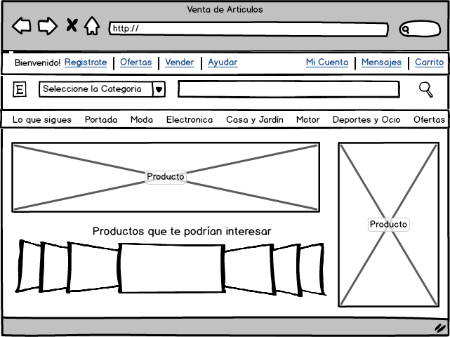

Un sitio que emplea esta técnica es ebay.es, la figura 1 hace referencia
a un bosquejo similar a esta página web. Se puede observar los tres
elementos esenciales, la barra de búsqueda con su respectivo botón de
lupa (buscar), un menú horizontal que muestra diferentes categorías de
productos que ofrece la página, esto hace alusión a la navegación, así
como también la parte inferior izquierda que le ofrece al usuario otros
productos alternativos. Y por último se muestra en el centro y al lado
derecho el producto que el usuario eligió, imágenes y características
del mismo.

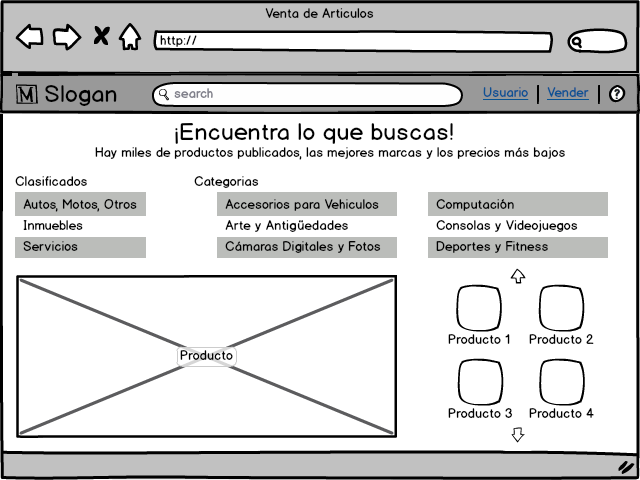

La figura 2 hace referencia el sitio mercadolibre.com, el cual ofrece
venta de productos a los usuarios, en él se muestra la barra de búsqueda
en la parte superior, en caso de la navegación ofrece una lista de
categorías y clasificados, así como posibles productos que el comprador
esté interesado. Y el producto en la parte inferior izquierda con
diferentes imágenes y características.

Flujo de Noticias
-----------------

Este patrón es generalmente, usado en sitios o aplicaciones de redes
sociales, noticias, correos electrónicos, blogs, etc. Esta técnica
muestra elementos en una lista cronológica inversa, es decir las últimas
noticias aparecen en la parte superior. La actualización se realiza de
manera dinámica y logra combinar distintos elementos como lo son fuentes
y personas en el mismo flujo.

Se utiliza cuando se desea exponer y promover la funcionalidad de su
sistema de guiar a las personas por las acciones de los demás. Sin
embargo no se debe utilizar cuando el sistema no tiene como uno de sus
elementos claves, la actividad de los usuarios.

Características
~~~~~~~~~~~~~~~

Se debe enumerar de manera que el orden cronológico sea inverso, para
que el flujo se actualice de manera automática en vez de que el usuario
solicite la actualización, sin embargo se debe dejar disponible la
opción de que el usuario pueda actualizar si así lo desea.

Se recomienda que cuando los flujos tienen mucha información se dividan
en categorías y que lo usuarios decidan cuales mostrar. También se puede
utilizar dos paneles o varios espacios que permitan manejar las
diferentes categorías.

Cada elemento o noticia debe incluir al menos, la siguiente información:

-  Qué: Título, descripción corta o imagen.
-  Quien: Autor, persona o fuente.
-  Cuando: Fecha, hora.
-  Dónde: lugar, organización, sitio web.

Se puede agregar un botón de “mas”, que muestre detalles adicionales del
elemento.

Como opcional, se puede agregar un campo de texto en la parte superior
para el usuario realice algún comentario o retroalimentación a alguno de
los elementos presentados en el flujo de noticias.

Ventajas
~~~~~~~~

Muchas empresas suelen usar esta técnica para mantener a sus clientes al
día con ofertas, descuentos, logos de empresa, entre otros. Mediante el
flujo de noticias se le facilita al usuario, mantenerse informado de
acontecimientos recientes, ya que puede seguirle el ritmo a las
noticias.

Ya que el flujo de noticias permite la combinación de diversas fuentes,
los usuarios se interesan por visitarlos y estar informados en tiempo
real de sus diferentes preferencias de temas. Usualmente, las personas
visitan este tipo de sitios cuando desean realizar pequeños descansos y
distraerse de su entorno.

Este patrón logra que el usuario no tenga que incurrir en ningún
esfuerzo para poder observar las últimas noticias, ya que estas siempre
se visualizaran en la parte superior, a su vez permite la participación,
ya que se exponen a los usuarios, posibles acciones que se pueden tomar
en el sitio y en un simple vistazo, estos usuarios pueden ver lo que
otras personas están haciendo y empezar a experimenta ellos mismos. En
este sentido el flujo de noticias es una alternativa al panel de
navegación que fomenta el descubrimiento.

Desventajas
~~~~~~~~~~~

Al ser esta técnica de modo informativo, requiere que el usuario este en
uso constante del sitio o aplicación que lo emplea, para que logre el
objetivo de estar al día en cuento a la información, si por el contrario
el usuario no le da casi uso, no tendrá conocimiento de noticias
anteriores a menos que se desplace lo suficiente por encontrarlas, sin
embargo si este es el caso se recomienda otro tipo de sitios de
noticias.

Ejemplos
~~~~~~~~

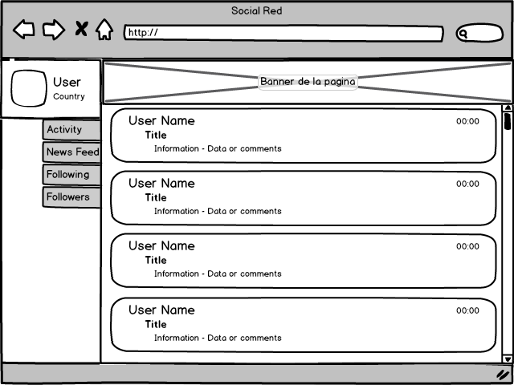

Las redes sociales se caracterizan por el uso de este patrón por lo que
la figura 3, presenta un bosquejo de un perfil social, donde el usuario
puede visualizar diferentes noticias en orden cronológico inverso, de
los usuarios o amigos que tenga asociados a su cuenta, por lo que si se
desplaza hacia abajo podrá observar noticias mas antiguas.

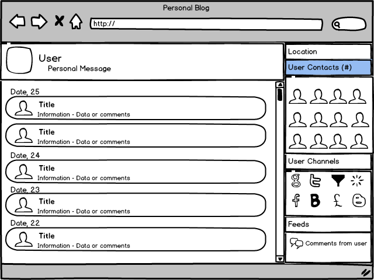

La figura anterior, número 4, hace referencia a otra red social, que
muestra del lado izquierdo información con su respectivo título y fecha
de publicación, eso si mantenido el orden cronológico inverso, por lo
que el usuario del perfil podrá ver lo último que ha sucedido y al lado
derecho se muestra como complemento los contactos, canales y otra
información relacionada con la cuenta.

Tablero de Mando
----------------

Este patrón se caracteriza por mostrar muchas listas de elementos
diferentes, correspondientemente clasificados por lo que permite el
despliegue de datos en una única página con información densa y
actualizada regularmente. Muestra a los usuarios información práctica y
relevante y deja personalizar el despliegue según sea necesario.

Se podría decir que una tabla de mando es un conjunto de patrones
anidados, ya que presentan diferentes técnicas dentro de él. Se suele
reconocer como una página de estilo familiar ya que abarca distintas
áreas de información útil y que se representan mediante gráficos,
imágenes, videos, etc.

Características
~~~~~~~~~~~~~~~

El primer paso es determinar la información más importante para el
usuario. Con base a eso se puede crear una jerarquía visual que acomode
las diferentes listas, tablas y gráficos de información en la pantalla.

Se debe procurar que el usuario logre ver toda la información en un solo
vistazo, es decir sin la necesidad de desplazarse, todo en una misma
ventana en la pantalla. Se permite agrupar información relacionada
mediante secciones con títulos y utilizar pestañas únicamente cuando se
está seguro que el usuario requiera abrir esa información en otra
ventana de manera simultánea.

Una técnica útil por utilizar es “drilldown” que se puede utilizar para
ver los detalles adicionales a los datos, es decir que mediante un clic
sobre un link, o gráfico se logre observar dicha información. Otra
técnica útil es el uso de “datatips” que sirven para mostrar datos
puntuales individuales conforme se mueve el puntero sobre algún gráfico
de información.

Se debe ser cauteloso a la hora de seleccionar gráficos, ya que deben
ser adecuados a la información que se desea representar, por lo que se
sugiere los gráficos de líneas o de barras. Sin embargo, si lo que se
desea representar es más importante, es mejor usar tablas o listas.

Ventajas
~~~~~~~~

Se utiliza cuando los sitios o aplicaciones ocupan flujos de entrada de
información de datos de un servidor web, noticias, charlas sociales,
información de negocios o financiera, entre otros, por lo que facilita
que los usuarios monitoren de manera continua esta información.

Es necesario comprender a los usuarios de estos sitios, así como sus
metas, para poder ser capaz de seleccionar la información más importante
para ellos y así lograr sus objetivos y brindar la opción de que el
usuario pueda personalizar aún más el tablero de mando.

Si esta técnica es bien implementada, resulta una potente solución para
la sobrecarga de información, ya que logra combinar los datos de
diferentes fuentes y logra dirigir la atención del usuario hacia la
información más importante para que puedan identificar rápidamente las
tendencias o áreas problemáticas y poder reaccionar ante ellas. Por lo
que logra hacer la vida más fácil de los usuarios y ayuda a tomar buenas
decisiones, a la vez que se ahorra mucho tiempo, aumentando la
productividad.

Resulta muy conveniente resaltar palabras claves y números para que el
usuario logre rápidamente concentrarse en la información relevante, ya
que al mostrar tanta información en conjunto el usuario suele distraerse
o no saber en qué enfocarse.

Desventajas
~~~~~~~~~~~

Actualmente, los usuarios y generalmente, los compradores en línea,
están acostumbrados a ver y utilizar este patrón de manera habitual, por
lo que una página web que esté orientada hacia este tipo de mercado que
no implemente este modelo, resultará tedioso y poco práctico para los
usuarios, por lo que corre el riesgo de ser poco utilizada y no cumplir
con los objetivos deseados.

Ejemplos
~~~~~~~~

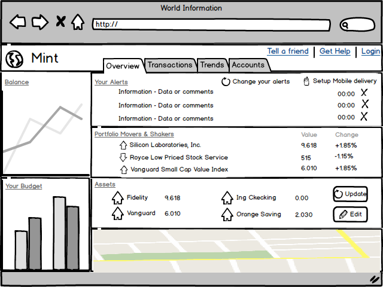

El sitio mint.com, versión beta, muestra información financiera,
previamente editada y personalizada por el usuario, por lo que le
permite ver en diferentes paneles, alertas, bolsas de valores,
subida/caída de valores, gráficas que reflejan balances y bolsas de
valores, así como mapas personalizables. Toda esta información hace
referencia a la figura 5, que como la técnica lo menciona reúne muchas
lista de elementos diferentes.

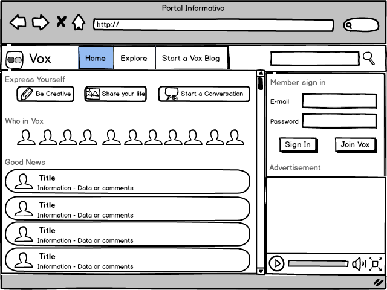

El sitio vox es un portal orientado a que los usuarios compartan y
socialicen, sin embargo utiliza la modalidad de tablero de mando porque
presenta diferentes listas de información como lo son contactos, flujos
de noticias, videos y diferentes opciones de entretenimiento, la figura
6 presenta un bosquejo de este sitio.

Lienzo más Paleta
-----------------

Este diseño (conocido como "canvas plus palette" en inglés) se concentra
en presentar un panel en blanco y al lado botones (Paleta) mediante los
cuales el usuario al dar clic crea objetos en el panel (Lienzo) en
blanco.

Características
~~~~~~~~~~~~~~~

Entre algunos de los rasgos encontrados que hacen que este patrón sea
muy propio de la mayoría de los editores gráficos, es que implica la
creación de nuevos objetos en un espacio virtual (Lienzo) donde se deben
ir organizando.

Además, la paleta siempre debe estar a un lado del lienzo, ya sea en la
parte superior o a la izquierda del mismo, para la facilidad de uso del
usuario.

La paleta puede estar constituida solo por iconos, pero si estos se
hacen poco entendibles, se les coloca una pequeña etiqueta. También, la
paleta se puede dividir en sub-grupos, como pestañas o paneles de
expansión tipo pila.

Ventajas
~~~~~~~~

Realmente, la técnica usada en este patrón trae consigo muchas ventajas
empezando porque las paletas todas son muy similares entre sí, lo que
hace presentar un alto reconocimiento visual por parte de los usuarios,
haciendo su utilización más eficaz y eficiente.

Con respecto a su distribución, la mayoría de las ocasiones aparece en
una sola ventana, en otras, presentado paneles de azulejos, pero siempre
mostrando las herramientas a un lado del gran área vacía llamada lienzo.
Como un aporte significativo, los creadores incluyen en estas
aplicaciones botones como zoom, o ver elemento creado, lo que hace al
usuario entrar en cercanía con los objetos que va creando.

Desventajas
~~~~~~~~~~~

Como todo patrón de diseño, presenta desventajas entre aplicaciones, la
más significativa es cuando los gestos utilizados varían de una
aplicación a otra, ya que pueden ser de arrastrar y soltar, o solo de
dar un simple clic en la paleta, otros trabajan con un clic en la paleta
seguido de un clic en el lienzo, por mencionar algunos, los cuales en
pruebas de usabilidad son muy variados.

Ejemplos
~~~~~~~~

En esta aplicación, como lo muestra la figura adjunta, se ve la paleta
al lado izquierdo de la pantalla con diversas opciones de colorear,
recortar…, a la derecha el gran panel en blanco y en la parte inferior
una paleta de colores, como se ha estipulado anteriormente.

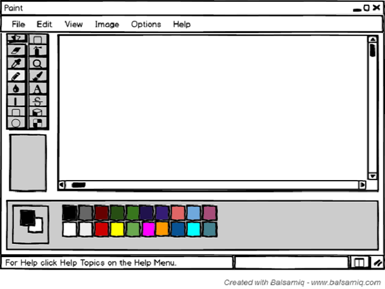

Otro ejemplo de canvas plus palette es Photoshop, que presenta paneles
despegables a la derecha, a su izquierda un panel de botones y en el
centro el lienzo, todo colocado en la misma ventana.

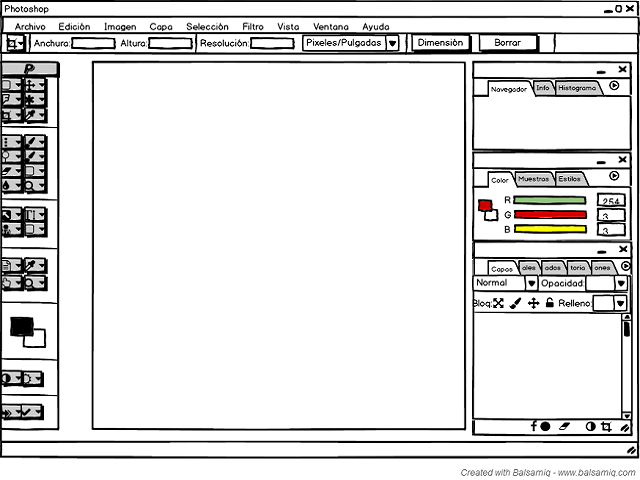

Asistente
---------

Este patrón (llamado "wizard" en inglés) lo que pretende es conducir al
usuario a través de la interfaz, mostrando paso a paso cada una de las
tareas, donde en cada una se puede escoger o cambiar valores
preestablecidos, en un orden prescrito.

Características
~~~~~~~~~~~~~~~

Cuenta con múltiples características ya que es usado cuando existe un
proceso largo y complicado, pues divide las tareas en sub-tareas
pequeñas, agilizando su uso, tal es el caso de subir una imagen a una
red social, ya que primero se sube y luego se recorta.

La interfaz puede ser dinámica, puesto que el usuario puede tomar
decisiones como omitir pasos o tomar ramas distintas; este es más usado
cuando el usuario no conoce del proceso y necesita orientación.

Como Wizard se basa en guiar al usuario, se usan valores predeterminados
los cuales el consumidor en la mayoría de las ocasiones acepta cediendo
el control de la aplicación a quien la diseño.

Las aplicaciones diseñadas dentro de este patrón, deben poseer botones
como cancelar, anterior y siguiente sin olvidar el botón Finalizar para
decirle al usuario que ha finalizado la tarea; al igual que en cada una
de las pantallas debe existir una etiqueta explicando lo que se
pretende, de la misma forma al iniciar la aplicación debe poseer una
etiqueta que sirva de “asistente”, para que el usuario entienda lo que
va a hacer y como lo va a hacer.

Ventajas
~~~~~~~~

Al dividir las tareas por partes, hace que el usuario entienda mejor lo
que está ejecutando y a su vez terminar el o los procesos de forma
satisfactoria. Son fáciles y rápidos de usar, ya que solo muestran dos
opciones en su mayoría que son anterior y siguiente y al finalizar
muestran un mensaje que indica que la tarea ha finalizado
favorablemente.

Desventajas
~~~~~~~~~~~

Las desventajas encontradas para este patrón y una de las más comunes
entre desarrolladores es saber encontrar un equilibrio a la hora de
dividir las tareas, ya que resulta tedioso para el usuario ver muchos
pasos, siendo así el caso que por largos y aburridos el usuario nunca
termine las tareas, además de que limita a los usuarios en las
decisiones que se quieran tomar.

No es recomendable usar este tipo diseño cuando la aplicación es usada
frecuentemente o cuando los usuarios deben tener mucho control del
proceso, pues para el diseñador de la interfaz va a ser difícil ponerse
en la posición del usuario y saber más que él.

Para no mantener todos los datos en una sola página, se pueden utilizar
los siguientes patrones:

-  Secciones de Títulos: Poner números a los títulos para que todos los
   pasos sean visibles a la vez.
-  Habilitación de Respuesta: Todos los pasos están presentes en la
   ventana, solo que se van activando conforme el usuario vaya
   avanzando.
-  Divulgación de Respuesta: Se muestra un paso de la interfaz pero
   hasta que el usuario de por finalizado el paso anterior.

Ejemplos
~~~~~~~~

Cuando creamos un Facebook, aparece la ventana adjunta, donde vemos que
cada paso informa al usuario lo que hace cada ventana y a la vez enumera
en que paso vamos, al igual de la opción de omitir el paso, pues la
ventana siguiente no es afectada con las decisiones de la ventana
actual.

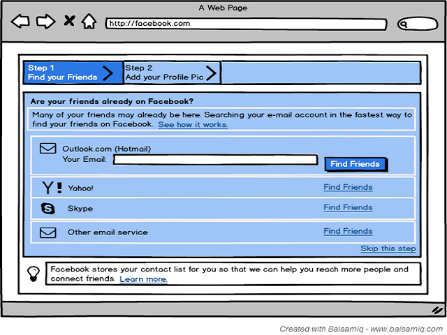

Lleva un orden, mediante el cual cada ventana depende de la información
de la ventana anterior, señalando de igual manera el número de paso,
junto con un título que resume correctamente la tarea de la ventana.

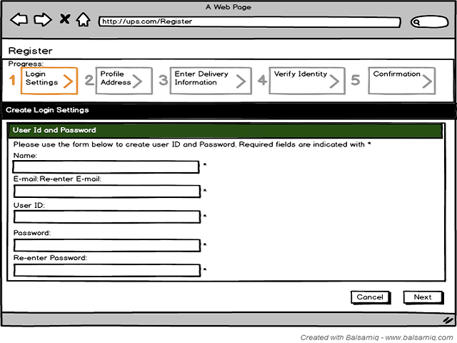

Editor de Configuración
-----------------------

Este patrón ("setting editor" en inglés) se encarga de proporcionar al
usuario una página o ventana fácil de usar, para que los usuarios puedan
cambiar configuraciones, propiedades o preferencias. Además, divide el
contenido en pestañas o en páginas por separado.

Características
~~~~~~~~~~~~~~~

Tiende a ser usado cuando se necesita manejar un gran número de
configuraciones, ya que los usuarios deben ser capaces de encontrar y
editar propiedades deseadas sin seguir una serie de complicados pasos,
además de que los usuarios tienen la capacidad de encontrar más
fácilmente las opciones cuando estas han sido ordenadas por categorías y
debidamente etiquetadas.

Otra de las opciones que caracteriza este patrón es que nombre de las
opciones debe ser fácil, y la configuración existente debe mostrarse al
usuario para que él pueda encontrar lo que quiere de una manera fácil y
rápida y a la vez modificar a su antojo la información.

Ventajas
~~~~~~~~

Por lo general, las ventanas de configuraciones tienen a ser fáciles de
encontrar, por lo que los nombres de las propiedades que las integran se
ubican rápidamente en una adecuada categorización, haciendo sentirse al
usuario familiarizado con la aplicación, además de que puede editar
solamente lo que el desee.

Desventajas
~~~~~~~~~~~

En algunas aplicaciones, cuando un usuario edita una propiedad, estas lo
guardan de forma automática, lo que hace que el usuario no pueda decidir
si de verdad quería hacer esos cambios.

Por otro parte se encuentra la dificultad por parte del diseñador de
como mostrar las ventanas, ya que lo pueden hacer por categorías,
pestañas, paneles, menús, pero no sobrecargando la forma que escoge,
porque para los usuarios resulta tedioso tener que trabajar sobre
jerarquías múltiples.

Ejemplos
~~~~~~~~

Panel de Control de Windows 8: Windows nos presenta en su ventana de
configuración la forma en que queremos presentar la información, en este
caso por categorías, mostrando cada una de ellas enlaces a las opciones,
las cuales presentan nombres entendibles por cualquier usuario (experto
o aprendiz).

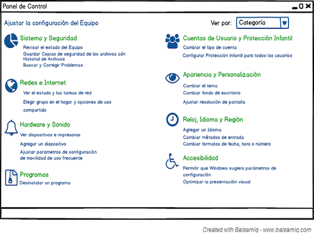

Configuraciones de Cuentas de Facebook: Facebook presenta en el panel
izquierdo las categorías y al dar clic aparecen las opciones
correspondientes en el panel de la derecha, con botones para poder
editar esa información sin que se guarde automáticamente.

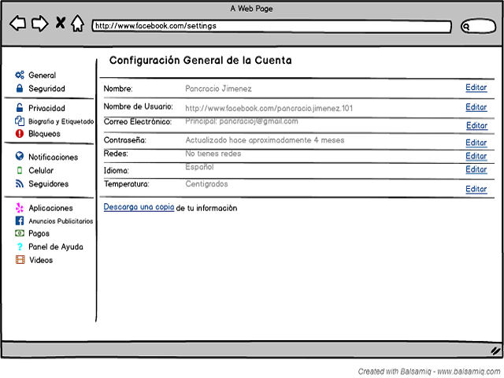

Vistas Alternativas
-------------------

Las aplicaciones más avanzadas de este patrón se orientarían hacia
diferentes puntos de vista sobre los mismos datos, tales como diferentes
visualizaciones y / o mecanismos de navegación para ayudar a los
usuarios a analizar y descubrir lo que necesitan. Por lo que la
funcionalidad principal de dicho patrón en este apartado como se verá va
enfocado hacia la creación de vistas alternativas con su respectiva
funcionalidad distribuida en las mismas y no en la interfaz que se
muestra por defecto (principal).

Características
~~~~~~~~~~~~~~~

Permite trabajar con varios conjuntos de información con características
distintas:

A travez del modelo del diseño, se puede incorporar dichas
características en distintas vistas y permitir al usuario elegir una
entre tantas de esas vistas, con eso se logra obtener y trabajar sobre
los conjuntos de características de manera separada, pero la elección de
las mismas es libre para el usuario, dando mayor fluidez y libertad en
el espacio de trabajo para el usuario y comodidad en la escogencia entre
las múltiples vistas y acciones a ejecutar en las mismas. Con dichos
ajustes se abordan las necesidades de cada quien. Importante saber que
cuando una interfaz contendrá múltiples funciones y dichas funciones
sobrecargarán a la interfaz principal lo mejor será crear varios
conjuntos de características distintas mediante múltiples vistas.

Permite la distribución de funcionalidades: Las cargas de trabajo que se
podrían dar en una interfaz mal diseñada que no aplica este patrón,
podrán ser muchas, y por lo tanto la usabilidad y manejo de esta
interfaz sería muy poco eficiente, lo ideal es liberar la carga,
separando necesidades en distintas vistas, con ello se evitaría la
sobrecarga de datos y funcionalidades de la interfaz principal.

Ventajas
~~~~~~~~

-  Mayor usabilidad: Los sistemas que incluyan este patrón como se
   mencionó anteriormente darán mayor usabilidad al sistema, evitando
   sobrecarga de datos en sólo una interfaz, además brindar por medio de
   distintas vistas las mismas funcionalidades pero de manera más
   organizada y bien distribuidas.
-  Mayor eficiencia del sistema: Se obtiene mayor velocidad, agilidad,
   estilos visuales que gustarán al usuario.
-  Ayudan al manteniendo de sistemas: Al dividirse las cargas y
   funciones a desarrollar en dado sistema, será de mayor facilidad al
   mantenimiento del mismo, ya que la información se encuentra bien
   distribuida y separada por distintas vistas.
-  Permite trabajar con grupos de información a elección del usuario: El
   usuario tendrán la posibilidad a travez de las múltiples vistas, la
   elección del grupo de información con el cual trabajar, de modo que
   si elige uno que en realidad no iba a ser de su agrado fácilmente
   puede navegar por medio de las vistas alternativas y elegir el que
   crea necesario y trabajar en el mismo en un módulo o interfaz
   distinta(alternativa).

Desventajas
~~~~~~~~~~~

-  No detectar las funcionalidades correctamente: No saber detectar
   cuales son realmente las funcionalidades que necesitan separación
   respecto a la interfaz principal, puede generar un gran gasto de
   tiempo en la misma, y sería inútil ya que el usuario no dará uso de
   dichas vistas.

Ejemplos
~~~~~~~~

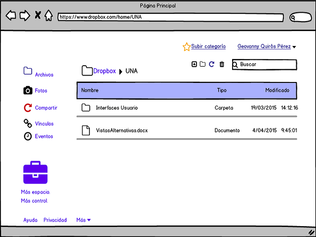

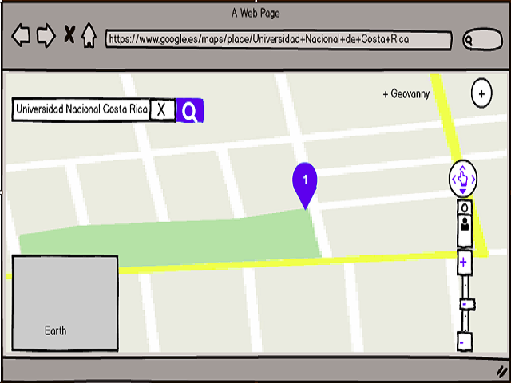

Múltiples áreas de trabajo
--------------------------

Permite y da la comodidad al usuario de crear su propio ambiente de
trabajo, dando la opción de colocar sus espacios de trabajo uno al lado
del otro simultáneamente. Pensado y creado para personas que trabajan o
realizan múltiples tareas al mismo tiempo(a estas personas se les conoce
como “multitask”) un ejemplo de este tipo de usuario, es el que está
realizando una tarea A de repente se da cuenta que necesita hacer una
tarea B, y así sucesivamente, por lo que este patrón le permite ejecutar
estas acciones mediante las múltiples áreas de trabajo; entonces una
buena interfaz que permita la ejecución de tareas múltiples es realmente
últil para este tipo de personas.

Características
~~~~~~~~~~~~~~~

Este tipo de patrón permite agrupar de mejor manera la información. Su
uso por lo general es cuando hay más de 2 secciones que mostrar o
trabajar, también cuando los nombres de sección son realmente cortos,
cuando se necesita abordar toda una ventana para trabajar. Se evita
usarlo por ejemplo cuando hay enlaces a otros sitios del sistema o
exteriores para ello se necesitará otro patrón.

Algunas de las recomendaciones para elaborar una correcta interfaz con
múltiples áreas de trabajo como por ejemplo: usar animaciones entre el
cambio de paneles o “pestañas”, usar iconos que representen el contenido
a mostrar, permitir el uso del teclado como la opción tab para navegar
entre pestañas, etc.

Existen muchas maneras de implementar esto en una interfaz entre ellas:

-  Tabuladores: Funcionan como pestañas una al lado de otra, cada
   “pestaña” contiene una tarea específica por lo que la navegación
   entre ellas es realmente fluida.
-  Columnas o paneles dentro de una misma ventana.
-  Ventanas divididas con divisores interactivos.

Ventajas
~~~~~~~~

-  Facilidad para cambios o pasos entre distintas tareas: Al tener las
   áreas de trabajo una seguida de la otra, el usuario podrá elegir
   entre las tareas que se muestran en las “pestañas”, por lo que el
   cambio entre las áreas es realmente rápido.
-  Obtiene toda la ventana para trabajo: Esta parte es una de las
   principales del porque la importancia de este patrón, el usuario
   podrá tener la libertad de usar todo el espacio que le provee cada
   “pestaña” por lo que se obtiene mayor provecho para el manejo y
   manipulación de mayor información.
-  Vista de la información de manera más clara y rápida: Cada pestaña
   tiene su título (el mismo tiene que ser claro), con ello el usuario
   podrá acceder de manera rápida a la información de tal manera que si
   trabaja en esa “pestaña” fácilmente puede navegar hacia otra u otras.
-  Fácil ubicación: Cuando un usuario trabaja en una “pestaña”, como
   tiene visible las demás dará una mejor ubicación en donde se
   encuentra trabajando y hacia donde puede ir, según lo desee.
-  Navegación: Permitir al usuario navegar por las “pestañas” en un
   orden lógico con la tecla Tab. Una pestaña centrada se podrá
   seleccionar con la tecla Enter.

Desventajas
~~~~~~~~~~~

-  Al permitir crear múltiples áreas, si el usuario no mantiene orden en
   las mismas puede generar confusión y/o fácilmente se puede perder la
   línea de trabajo.

Ejemplos
~~~~~~~~

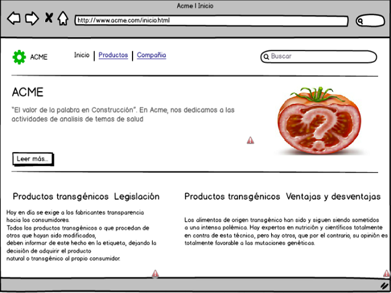

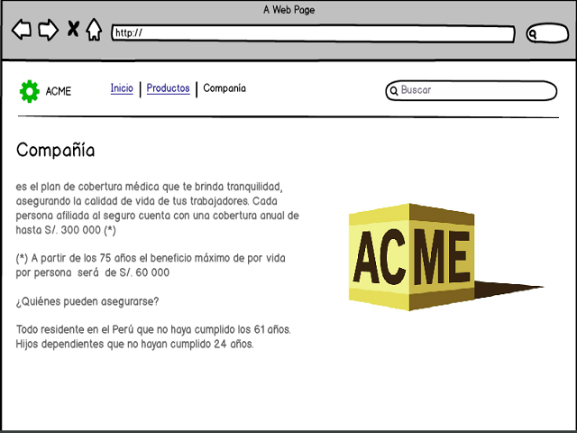

Múltiples niveles de ayuda
--------------------------

Patrón que brinda soporte o ayuda a travez de técnicas implementadas en
la interfaz, con el fin de brindar orientación en los distintos procesos
que ejecuta el usuario en el sistema. Básicamente se puede usar cuando
el sistema en sí es muy complejo y el usuario necesita una ayuda extra
para desarrollar sus funciones, para ello se contará con el nivel de
ayuda múltiple. Se utiliza cuando se ha diseñado una interfaz de usuario
muy interactiva, con información y funciones muy complejas, por ejemplo
los lectores de correo, software de base de datos, herramientas de
autor, software de gráficos y entornos de programación, también para
motivar al usuario para empezar a hacer uso del sistema, además que
puede dar una idea general al usuario o también muy particular de lo que
involucra el sistema.

Se puede implementar usando texto de aviso de ayuda, por ejemplo cuando
hay un campo de entrada de email, se le puede emitir un cuadro de
dialogo al lado en caso de que sea incorrecto; en el menú contextual
opciones de ayuda para determinadas funciones, esto podría incluir
iconos interactivos como “?” indicando que puede encontrar ayuda; se
pueden incluir ejemplos para determinada tarea, esto puede hacerse
mediante un videos para una determinada tarea; incluir una introducción
de uso pequeña en el inicio de la aplicación; también instrucciones en
línea de ayuda, por ejemplo para el campo de una contraseña, indicar al
lado lo que necesita para una contraseña segura y/o las reglas o formato
que debe tener por ejemplo, etc. Para usuarios avanzados es recomendable
tener la opción ocultar o hacer invisible las ayudas.

Ventajas
~~~~~~~~

-  Ayudar al entendimiento y uso eficiente del software: Al tener
   distintos tipos de ayuda dentro de la interfaz de un sistema, el
   usuario podrá acceder a ella y con eso se le facilitará y mejorará el
   uso del sistema, dando un mejor uso del mismo.
-  Ayuda a usuarios de poco conocimiento al desarrollo de tareas
   difíciles: En el proceso de entendimiento a un usuario novatos de un
   sistema complejo, se le facilita por medio de la ayudas y/o guías, y
   con ello el uso de funciones complejas del sistema de una mejor y
   rápida ayuda.
-  Hace menos vulnerable al sistema de errores, brindando ayudas para
   evirtarlo: Al tener ayudas de como realizar las acciones en el
   sistema, se disminuiría los fallos dentro del sistema ya sea por
   errores en la manipulación de información por usuario de manera
   errónea.
-  Al proporcionar al usuario una instrucción de asistencia a un lado de
   una interacción, es más fácil para el usuario para relacionar la
   instrucción.

Desventajas
~~~~~~~~~~~

-  Si la manera de mostrar la ayuda no es bien implementada, tomando
   consideraciones del usuario, puede resultar irritante para el mismo.
-  Las funciones difíciles de desarrollar en un sistema con ayudas
   “pobres” resultaría difícil para el usuario desarrollar las acciones
   en el mismo.
-  Para usuarios avanzados puede ser muy molesto los mensajes o avisos
   de ayuda ya que tienen amplia experiencia en uso y manejo de estos
   sistemas y si no se incluye una opción de “invisible” u “oculto”
   puede ser tedioso el lidiar con esos mensajes de ayuda.

Ejemplos
~~~~~~~~

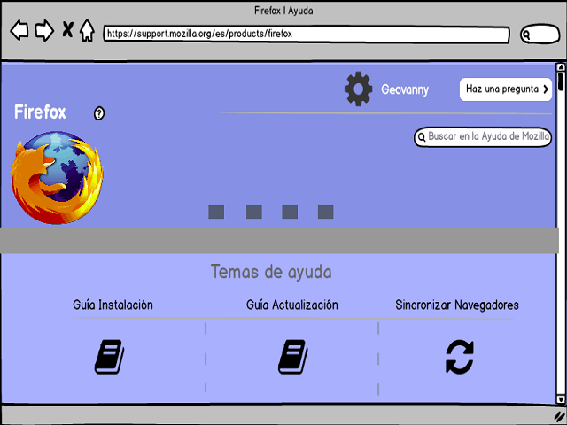

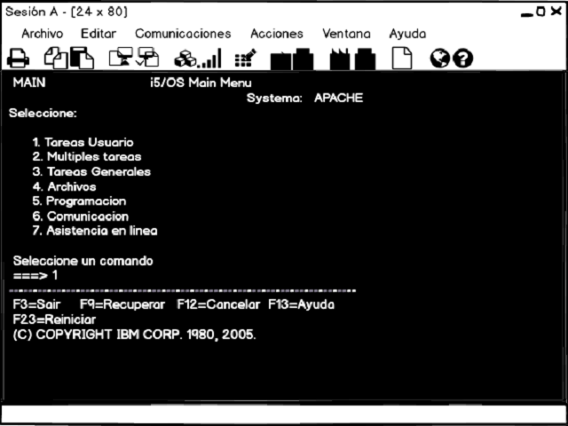

Gestión de Imágenes
-------------------

En este patrón se utiliza una interfaz para la gestión de vistas, vídeos
y otros elementos, principalmente mediante miniaturas, vista de
elementos y una interfaz de navegación.

Características
~~~~~~~~~~~~~~~

Por lo general las personas trabajan con listas o colecciones cuando se
trata de manejo o administración de elementos visuales o videos, donde
el usuario puede editar sobre ellos mismos o tener la vista. Mediante
este patrón se puede garantizar lo anterior descrito.

Ventajas
~~~~~~~~

-  Facilidad en la organización de la información
-  Facilidad en la navegación
-  Fácil acceso para la modificación, búsqueda o vista de la información

Desventajas
~~~~~~~~~~~

-  A veces resulta difícil usarlos.

Ejemplos
~~~~~~~~

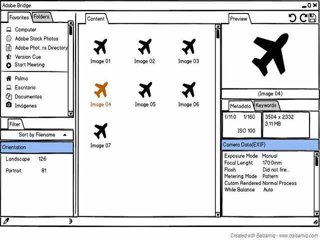

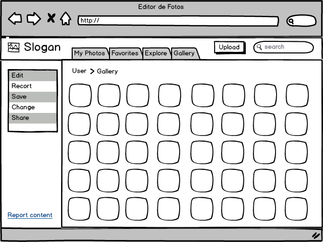

Glosario
--------

-  Datatips: Muestra datos puntuales, conforme se mueve el puntero sobre
   alguna representación.

-  Drilldown: Implica  hacer clic en alguna representación con el fin de
   revelar más detalles.

-  Aplicación: Programa informático que permite al usuario utilizar una
   computadora para un fin específico.

-  Jerarquías Múltiples: Tener que navegar entre ventanas para llegar al
   destino final.

-  Organización de Contenido: Acomodar la vista de la aplicación de modo
   que para el usuario sea fácil de familiarizarse.

-  Paneles Plegables: Despliega sus opciones en algún sentido, al dar
   clic sobre el nombre categórico.

Referencias
-----------

-  Few, S. (2006). *Information Dashboard Design*. O'Reilly Media,
   Incorporated.

-  Kuhn, S. (2009). Activity Stream Scanning Affordances . En *Users are
   Human* (págs. 10-13).

-  Lammi, J. (2010). *http://patternry.com/*. Obtenido de Information
   Dashboard: http://patternry.com/p=information-dashboard/

-  Microsoft (Tienda Windows). (s.f.). *Microsoft.com*. Obtenido de
   Patrones de navegación (aplicaciones de la Tienda Windows):
   https://msdn.microsoft.com/es-es/library/windows/apps/hh761500.aspx

-  Montero, S., Zarraonadía, T., Díaz, P., Aedo, I., Pérez Sanz, &
   Lorenzo Pérez, A. (2011). Diseño web. *En Patrones de diseño
   aplicados al desarrollo de objetos digitales educativos (ODE)* (págs.
   29-32). España: Ministerio de Educación.

-  *Quince*. (s.f.). Obtenido de AllPatterns:
   http://quince.infragistics.com/html/AllPatterns.aspx

-  Tidwell, J. (2011). *Designing Interfaces: Organizing the Content.*
   Sebastopol, Canada: O'Reilly Media, Inc.

-  *UI Patterns*. (s.f.). Obtenido de Activity Stream:
   http://ui-patterns.com/patterns/ActivityStream

-  Edition, J. T. (2011). Designing Interfaces. Canada: O’Reilly Media,
   Inc., 1005 Gravenstein Highway North, Sebastopol, CA 95472. .

-  J, T. (s.f.). flylib.com. Obtenido de
   http://flylib.com/books/en/3.323.1.22/1/

-  ORGANIZING THE CONTENT. (2009). Obtenido de
   https://www.google.com/url?sa=t&rct=j&q=&esrc=s&source=web&cd=8&cad=rja&uact=8&ved=0CDYQFjAH&url=http%3A%2F%2Fwww.cs.montana.edu%2Fcourses%2Fcsci491%2F09.14.09%2Flecture\_ppt.pptx&ei=6ZgoVfjUDK3IsATzvIGIDQ&usg=AFQjCNH5xGwJ7tInUNzoDTEiKb-H0BxnCA&sig2=1-V5Aj

-  Toxboe, A. (2007-2015). UI-Patterns.com. Obtenido de
   http://ui-patterns.com/patterns/Wizard

