Mecanismos de navegación
========================

**Recopilado por**: Bryan Valerio Herrera y Jeffry Arias Chaves

Los mecanismos de navegación se relacionan a los diferentes modelos de
navegación que pueden ser utilizados. El modelo de navegación tiene que
ver con cómo las diferentes pantallas se enlazan entre sí, y cómo hacen
los usuarios para moverse entre ellas.

Es importante resaltar que todos estos mecanismos pueden ser mostrados
en pantalla en diferentes formas: pestañas, menús, árboles, etc.

Puntos de entrada claros
------------------------

¿Cómo hace el usuario para saber dónde comenzar en un sitio complejo o
una app? Los puntos de entrada claros ("clear entry points" en inglés)
le muestran a él donde ir primero. En pocas palabras le ofrece a las
personas un conjunto de puntos de entrada claros en el lugar de
aplicación o web basado en sus tareas o destinos más comunes lo que
ayuda al auto aprendizaje.

Características
~~~~~~~~~~~~~~~

Es usado cuando se tiene una página Web o Aplicación en la que se tiene
frecuentemente muchos usuarios primerizos o que la frecuentan muy pocas
veces. A muchos de los usuarios les va con leer un texto introductorio,
hacer una tarea inicial, o la escoger unas pocas opciones de uso
frecuente.

Ventajas
~~~~~~~~

Sin claros puntos de acceso, los usuarios nuevos o poco frecuentes
pueden sentirse perdido inmediatamente al abrir una aplicación o sitio.
Al guiar a personas con puntos de acceso claros, se toma la carga mental
fuera de ellos para averiguar lo que pueden o deben hacer; en pocas
palabras, ofrece unas pocas opciones para que el usuario escoja y
comience a trabajar inmediatamente.

Desventajas
~~~~~~~~~~~

Este modelo sólo funciona si usted tiene o puede descubrir un conjunto
de las tareas o los destinos más comunes para un público en específico.
Si no se puede hacer esto, el patrón causara más problemas que
soluciones, ya que se interpone en el camino y realmente no guiar a la
gente a lo que ellos quieren hacer.

Ejemplos
~~~~~~~~

El primer ejemplo se ve una página sencilla con solo unas pocas
opciones, lo cual le facilita al usuario el entendimiento y la
funcionabilidad de ella.

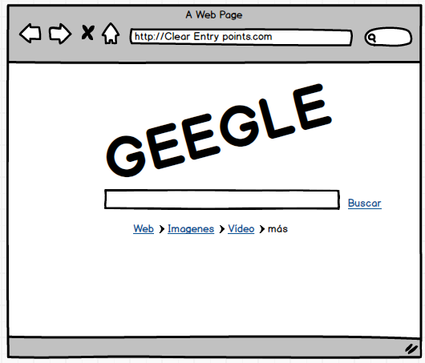

El segundo ejemplo muestra una aplicación de celular donde al presionar
un botón nos muestra cinco opciones, es muy util cuando los usuarios no
están muy familiarizados con su uso.

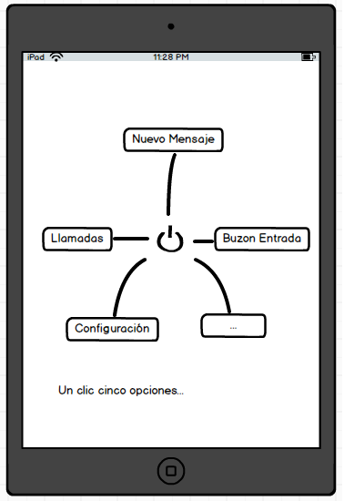

Este diseño de navegación se puede observar en las siguientes páginas:
`www.adobe.com / <www.adobe.com>`__ y
`www.google.com <www.google.com>`__

Menú de página
--------------

El menú de página ("menu page" en inglés) ofrece una lista de accesos
con el contenido de las páginas en el sitio o de la aplicación. Además
de mostrar información suficiente de cada acceso con la cual el usuario
puede escoger bien lo que quiere.

Si se crea una aplicación móvil, el menú de página sería una de las
principales herramientas para el sitio o de una aplicación con muchos
niveles de funcionalidad, ya que si se mantiene unas etiquetas pequeñas,
hace que los botones sean más grandes lo que facilita el presionarlos.

Características
~~~~~~~~~~~~~~~

Se emplea en las páginas de inicio o una página dedicada a ser sólo una
tabla de contenidos. Aún que se puede perder espacio para contenido
destacado (como un artículo, video u oferta), lo que se ocupa es que el
usuario elija un enlace sin distracciones.

En las aplicaciones móviles y sitios necesitan especialmente páginas de
menú para hacer el mejor uso de sus pantallas pequeñas.

Ventajas
~~~~~~~~

Sin distracciones los usuarios se pueden concentrar en las opciones de
navegación, se tiene toda la pantalla para organizar, explicar, e
ilustrar los accesos, lo que puede conducir a los usuarios a de una
forma más apropiada a su página de destino.

Desventajas
~~~~~~~~~~~

No se recomienda usar este diseño si se va a implementar artículos con
promociones u otros contenidos interesantes. Se tiene que tomar riesgos
al usar este patrón de navegación ya que se debe de tener en cuenta que
los usuarios ya conocen esta página, los usuarios saben que van a buscar
y donde encontrarlo, y que no estarán interesados en noticas,
actualizaciones o características.

Ejemplos
~~~~~~~~

En este ejemplo se ve el menú de una página web, usando un efecto de
acordeón.

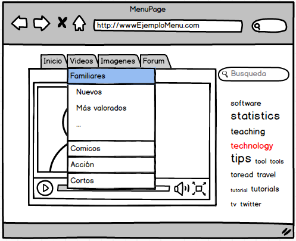

Ejemplo de un menú de una aplicación de celular

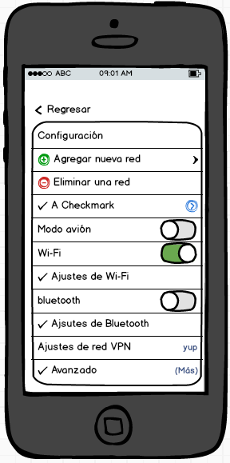

Pirámide
--------

Es un modelo de navegación en el cual los accesos se juntan y forman una
secuencia de páginas con la herramienta de Anterior/ Siguiente. En pocas
palabras se crea una página padre a la cual se le van a se le envían
todos los accesos en secuencia, y estos pueden ser visto en secuencia o
sin orden.

Características
~~~~~~~~~~~~~~~

Las páginas o aplicaciones contienen una secuencia de elementos el cual
el usuario puede ver normalmente uno después del otro, algo así como una
presentación de diapositivas, un asistente, un capítulo de un libro, o
un conjunto de productos. Casi todos los Controladores de Imágenes usan
este modelo de navegación. Ya que algunas personas necesitan ver las
imágenes de forma individual, y algunas otras veces ellos prefieren
navegar por todo la secuencia. El modelo de pirámide soporta ambos
casos.

Ventajas
~~~~~~~~

Este patrón de diseño disminuye el número de clics que se necesitan para
moverse entre la página, además mejora la eficiencia de la navegación, y
crea una relación secuencial entre las páginas; el uso de los botones
Anterior/Siguiente le favorecen ya que las personas saben qué hacer en
ellos. Al poner un enlace en la página principal de cada secuencia,
aumentas las opciones del usuario a la hora de escoger; es decir ya no
sería solo un Anterior/Siguiente sino que además agregamos un Arriba (up
/ regresar al menú), lo cual le ayudara al usuario a dar menos clic para
ir a donde desea ir.

Desventajas
~~~~~~~~~~~

Al hacer los accesos secuenciales, implica que para volver a la página
de donde se empezó se ocupa hacer la misma cantidad de clic en el botón
de anterior para poder volver.

Ejemplo
~~~~~~~

El siguiente ejemplo muestra lo que sería un diseño de pirámide en una
página web, donde se puede observar a la izquierda los tags de temas, el
autor de la imagen; mientras que abajo podemos ver los accesos para ir a
la imagen anterior, o la siguiente.

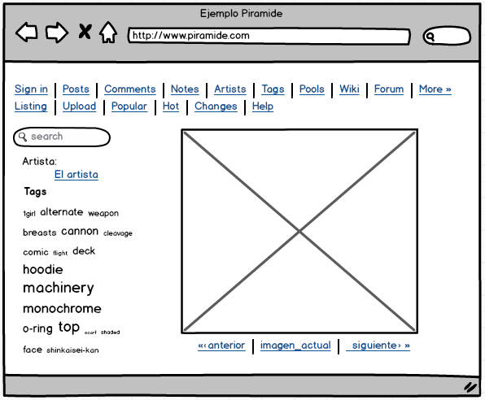

Una página web que implementa este modelo es https://danbooru.donmai.us/
el cuál es un visualizar de galerías de imágenes agrupadas por autores,
categorías, genero, etc.

Panel modal
-----------

Debido a que las personas se distraen con mucha facilidad se tiene que
hacer algo para captar su atención completa. Por eso este modelo de
diseño brinda al usuario una ventana sin opciones de navegación, solo
mensajes de conocimiento, formularios por completar, o un panel de
cliqueo. Los paneles modales suelen mostrase en una capa encima de la
pantalla completa o página, y son usadas para cosas pequeñas, tareas
enfocadas las cuales requieren de toda la atención del usuario.

Características
~~~~~~~~~~~~~~~

Solo se puede mostrar una página, sin opciones de navegación, y se
termina cuando el usuario concluye la tarea, no se recomiendan usar
cuando se requiere de la confirmación de una opción, en su lugar se
prefiere la opción de deshacer, un control de reciclaje.

Ventajas
~~~~~~~~

Son muy útiles cuando se requiere información relevante; suelen ser
cosas o tareas pequeñas; le dan ciertos detalles llamativos a las
imágenes. Además debemos tomamos en cuenta la lógica que subyace detrás
de todos los paneles de modales, la cual es tratar de captar la atención
de la gente, conseguir que se centran en lo que está en el panel, y
después de tomar algún tipo de acción, incluso si la acción es
simplemente cerrando el diálogo.

Desventajas
~~~~~~~~~~~

Se deben de usar los paneles modales con moderación porque interrumpen
el flujo y crean un trabajo extra al servidor; este modelo de navegación
bloquea todo la pantalla y no continua hasta que el usuario finalice la
tarea encomendada.

Ejemplos
~~~~~~~~

El primer ejemplo nos muestra un ejemplo con el efecto de
"Confirmación", en el cual se puede ver que requiere de la atención del
usuario para continuar con la operación.

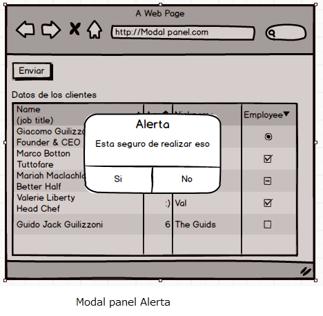

El segundo ejemplo muestra un modal con los datos de un formulario, en
el cuál se requiere de la atención del usuario para su conclusión.

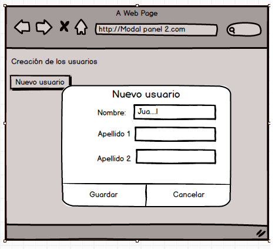

Este diseño de navegación se puede ver en las siguientes páginas
`www.picasa.google.com <www.picasa.google.com>`__ y en
http://quince.infragistics.com

Estado de vínculo-profundo
--------------------------

Este patrón (llamado "Deep-linked State" en inglés ) sirve para capturar
el estado de la página o de la aplicación en una URL (Dirección Web), la
cual puede guardarse y enviarse a otra persona, y esta cuando la abre,
este restaura el estado de la aplicación que el usuario estaba viendo.

Características
~~~~~~~~~~~~~~~

Se emplea en sitios o aplicaciones que tiene grandes contenidos o que
sean interactivos como mapas, libros, videos o información gráfica.
Donde para llegar a un punto deseado se tiene que pasar por muchos
estados, parámetros configurables, como la visualización, escalas, etc.
lo que puede darle más complejidad de llegar a ese punto en particular y
poder verlo de manera correcta.

Ventajas
~~~~~~~~

Ayuda al usuario a llegar directamente a un punto deseado de la
aplicación, lo que le ahorra tiempo y trabajo. Este modelo es útil para
guardar estados que el usuario va a volver a crear más adelante. Pueden
ser guardados como un favorito del navegador. También es útil para el
estado con otras personas, que es donde se especializa este modelo de
navegación, este vínculo se puede enviar por correo, tweets de las redes
sociales, en foros de discusión, publicación de un blog, y en muchas
otras maneras.

Desventajas
~~~~~~~~~~~

No se han encontrado. Solo dificultad al programarla.

Ejemplos
~~~~~~~~

El ejemplo de abajo muestra una página web con un diseño de estado de
vinculo-profundo, en donde podemos hacer los cambios de dirección o
buscar un sitio en particular, además podemos hacer uso del zoom y todo
esos datos se guardan en la URL de la página.

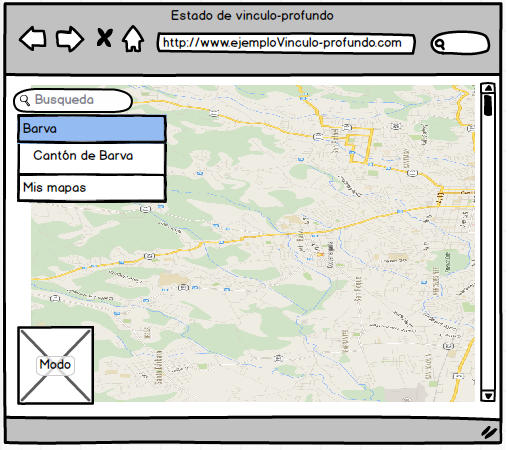

Una página web que utiliza este patrón es: https://www.google.es/maps

Vía de escape
-------------

Este patrón (llamado "escape hatch" en inglés) se suele implementar en
páginas que tienen un poco navegación, o cuando se llega a un Ciclo o a
un Panel Modal. Los usuarios podrían ser capaces de llegar a estas
páginas fuera de contexto, ya que lo podrían hacer a través de
resultados de búsqueda. Se puede entender como una característica para
que los usuarios no se sientan atrapados en las páginas o aplicaciones,
le da la libertad de que exploren el sitio con seguridad.

Características
~~~~~~~~~~~~~~~

Se utiliza en páginas que constituyen una especie de proceso en serie,
como un asistente de configuración, o cualquiera de las páginas que
bloquean al usuario cuando este se encuenta en una situación con
navegación limitada, como un panel modal. Estas podrían ser las páginas
que los usuarios pueden llegar fuera de contexto, ya que podría hacer a
través de resultados de búsqueda.

Ventajas
~~~~~~~~

La navegación limitada es una cosa, pero el no tienen manera de salir de
ahí es otra muy distinta!; si usted le da al usuario una forma simple y
a la vez obvia para escapar de una página, sin condiciones, es menos
probable que se sienta atrapado allí. Este es el tipo de característica
ayuda a las personas a sientan confianza de explorar con mayor seguridad
una aplicación o sitio. Es algo así como la función de deshacer la cual
anima a la personas a hacer cosas sin preocuparse.

Desventajas
~~~~~~~~~~~

No se encontraron.

Ejemplos
~~~~~~~~

En el primer ejemplo podes ver que una de las vías de escape de un Panel
modal es el botón cancelar. Lo que podría evitar serios problemas al
sistema.

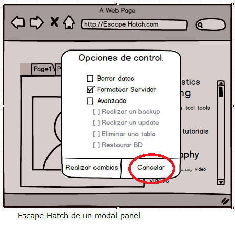

En la segunda imagen se aprecia a un usuario que se adentró demasiado en
una página web, y que no sabe qué hacer, por lo que en estos casos se
recomienda como medida de escape el implementar una barra de navegación
como un menú o un botón o vinculo.

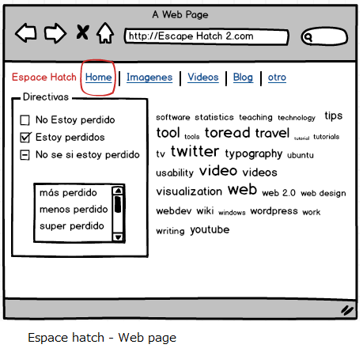

Menús gruesos (Fat Menus)
-------------------------

Son los diseños que muestran una gran lista de opciones de navegación en
un menú desplegable, se utilizan para mostrar todas las sub-páginas que
contiene el sitio. Para que este sea del agrado de los usuarios, se debe
de organizar con cuidado, ya sea por categorías, clasificación o
agrupaciones. Los hay en dos tipos los menús de cabecera y los de pie de
página.

Características
~~~~~~~~~~~~~~~

Los sitios web o aplicaciones que tengan muchas categorías, y que
posiblemente contengan una jerarquía de tres o más niveles. Y se
requiere exponer la mayoría de estas páginas a la vista de los usuarios,
ya que así se evita que estén explorando el sitio. Se suelen usar en
menús desplegables

Ventajas
~~~~~~~~

Los menús gruesos hacen de un sitio complejo más amigable. Exponen
muchas más opciones de navegación a los usuarios de las que podrían
encontrar si navegaran entre la página. Al tener tantos enlaces hace
posible que los usuarios vayan directo a cualquier página secundaria sin
tener que pasar por un sin número de ellas.

Desventajas
~~~~~~~~~~~

Solo sirve en páginas que tengan varios niveles de jerarquías, o que
contengan muchas sub-páginas.

Ejemplos
~~~~~~~~

El siguiente ejemplo muestra un menú grueso, que lo único que lo
distingue de los menús comunes es que en estos se alberga una gran
cantidad de Vínculos, la mayoría divido por categorías en este caso se
tratan de una lista de eventos.

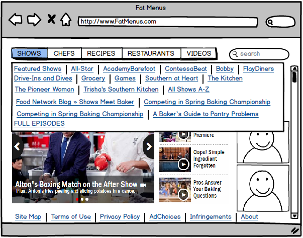

Unas páginas que usan este tipo de diseño son:
https://www.netflix.com/cr/ y http://www.foodnetwork.com

Mapa del sitio en el pie de página
----------------------------------

Coloque un mapa del sitio en el pie de página para cada página del
sitio. Este debe ser tratado como parte de la navegación global, o un
complemento al encabezado. Si es un espacio pequeño reduzca las partes
del mapa para que pueda ser ubicado en el pie de página.

Un mapa de un sitio es una representación de la estructura de un sitio
utilizado para la navegación sobre el mismo. Esto permite tener una
vista general de los contenidos del sitio de un solo vistazo. Al
utilizar un mapa del sitio, los visitantes pueden saltar directamente a
cualquier página listada.

Características
~~~~~~~~~~~~~~~

Recientemente, los mapas de sitio han sido reconocidos como una manera
de optimizar la indexación de los motores de búsqueda. Esto porque los
motores de búsqueda pueden tener mejor vista general del contenido total
a través del mapa.

Este patrón se utiliza cuando el sitio que usted esta diseñando usa
mucho espacio en cada página, y no se tiene restricciones en el tamaño
de la página o el tiempo de descarga. El sitio tiene gran cantidad de
páginas, pero no muchas categorías. En estos casos se puede encajar el
mapa del sitio completo en una tira que no sobrepase la mitad de la
ventana del navegador. Puede haber un menú de navegación global en el
encabezado de la página, pero este no muestra todos los niveles de
jerarquía del sitio. Es preferible un simple y bien diseñado pie de
página.

Al mostrar muchos enlaces en cada página, se da la posibilidad al
usuario de saltar directamente de cualquier sub-página a cualquier otra.
El pie de página es donde aterriza la atención del usuario cuando se
alcanza el final de la página, al colocar enlaces interesantes en este,
se logra que el usuario permanezca en el sitio y lea aún más contenido.

Ventajas
~~~~~~~~

-  Los mapas del sitio hacen que los sitios complejos sean más fácil de
   explorar.
-  Estos exponen más opciones de navegación a los visitantes de lo
   normal.
-  Al mostrar al usuario el mapa del sitio completo da un sentido de
   cómo está estructurado el sitio y donde se puede encontrar las
   características más relevantes.
-  En el caso de sitios convencionales, este patrón es muy fácil de
   implementar y depurar ya que este no depende de ningún contenido
   dinámico.

Desventajas
~~~~~~~~~~~

-  Tiende a ser ignorado por usuarios ocupados o casuales que se enfocan
   solo en el contenido de la página y el encabezado.

El mapa debe contener las secciones principales del sitio como las
categorías y las sub-páginas más importantes, algunas otras
características de los mapas del sitio son:

-  Categorías de mayor importancia.
-  Información acerca de la organización del sitio.
-  Sitios asociados.
-  Enlaces de comunidad, como foros.
-  Ayuda y soporte.
-  Información de contacto.
-  Ofertas actuales.
-  Donaciones o información de voluntariado, en el caso de

Ejemplos
~~~~~~~~

|image0| |image1|

Herramientas de sesión
----------------------

Este patrón es muy útil en cualquier sitio o servicio donde se requiere
que los usuarios inicien sesión. La convención indica, que las personas
esperan encontrar esta herramienta en la esquina superior derecha, por
lo tanto, para garantizar una experiencia agradable para el usuario se
debe colocar esta herramienta donde ellos esperan encontrarla.

Características
~~~~~~~~~~~~~~~

La manera correcta de utilizar esta herramienta es colocar el nombre de
usuario y asegurarse de que esta se vea y funcione de igual manera en
todas las páginas que lo contengan. Otras herramientas que se utilizan
de la mano son el botón de inicio de sesión, configuración de la cuenta,
configuración del perfil, ayuda del sitio, servicio al cliente, carrito
de compras, mensajes personales o algún tipo de notificaciones, enlaces
a colecciones de objetos personales y el enlace a la página de inicio.

Ventajas
~~~~~~~~

Este un objeto típico de navegación de utilidades, siempre debe estar
ahí para cuando el usuario lo necesite y sino no debe de alterar el uso
común del sitio. Para algunos de los elementos se pueden utilizar iconos
pequeños en lugar de texto, como por ejemplo el carrito de compras.

Ejemplos
~~~~~~~~

|image2| |image3|

Mapa de secuencia
-----------------

También conocidos en inglés como: ‘Progress indicator’, ‘Multi-step
Progress Bar (or Indicator)’, ‘Wizard Steps’, ‘Progress Train’ y ‘Steps
Left’

En cada página en secuencia, se muestra un mapa de todas las páginas en
orden, incluyendo un indicador de su ubicación actual. Se usa cuando se
diseña un narrado escrito, un flujo de proceso, una guía o cualquier
otra sitio en el que el usuario progresa página por página. Normalmente
la ruta del usuario es lineal.

La idea principal es dar a conocer al usuario cual ha sido su recorrido
a través de una serie de pasos y a la vez que tanto le hace falta para
terminar la actividad. Conociendo esto le ayuda al usuario a decidir si
quiere continuar, estimar cuanto tiempo le tomara terminar y permanecer
orientado. Los mapas de navegación también funcionan como dispositivos
de navegación, ya que si es necesario devolverse en la línea de
actividades, se puede lograr con tan solo hacer click en el paso
requerido en el mapa.

Características
~~~~~~~~~~~~~~~

Se utiliza cerca de los bordes de las páginas, se coloca un pequeño mapa
de páginas de secuencia. La idea es hacerlo en una línea o columna para
así evitar que compita visualmente con el contenido de la página. El
indicador de la página actual tiene que ser fácil de ubicar, dándole un
color diferente al de los demás es buena manera de diferenciarlo, la
misma técnica se utiliza con las páginas que ya han sido visitadas.

Para la conveniencia del usuario se suele colocar el mapa de secuencia
cerca o después de los controles de navegación principales, como los
controles de Atrás/Siguiente. Si las páginas o pasos son numerados se
deben especificar la secuencia con la misma numeración, pero siempre se
recomienda poner el nombre del sitio en el mapa.

Se agrega un bloque de gráficos que describen los pasos para ingresar
datos en el sistema, este bloque siempre debe aparecer en el mismo lugar
de la página. Si existe la necesidad de mostrar que pasos están por
venir en un proceso específico, o si existe la necesidad de simplificar
el diseño en las páginas que contienen los pasos, se pueden quitar
elementos que generen distracciones innecesarias , como elementos de
navegación extras, anuncios o similares.

Ventajas
~~~~~~~~

Este patrón es crítico en páginas de compras, donde el proceso de pago
es normalmente guiado de esta manera. En las páginas de compras, el
proceso de pago es la parte más crítica del sitio, ya que esta se
encarga de capturar el dinero de los clientes. Un mapa de secuencia
brinda al usuario una visión general de cuanto ha avanzado en el
proceso, provee un final marcado del proceso que el usuario puede tener
como objetivo. Este patrón es similar a las guías de instalación
(Wizards) que utilizan las aplicaciones de máquinas de escritorio, las
cuales permiten al usuario hacer sus elecciones paso a paso.

Ejemplos
~~~~~~~~

|image4| |image5|

Migas de pan
------------

Se usa cuando la aplicación o sitio tiene una estructura jerárquica con
dos o más niveles. Cuando los usuarios se mueven a través de navegación
directa o realizando búsquedas dentro del sitio, la navegación global no
es suficiente para mostrar donde se encuentra ubicado el usuario, esto
debido a que la jerarquía es muy grande o profunda.

En estos casos se utiliza este patrón, el cual muestra cada nivel de
jerarquía con respecto a la página actual, desde lo más alto de la
aplicación hasta los más abajo. En buen sentido, muestra una parte
lineal del mapa general de la aplicación. Entonces al igual que los
mapas de secuencia, este patrón ayuda al usuario a saber en dónde se
encuentra ubicado. Esto es muy útil si el usuario ha realizado un salto
abrupto hacia algún lugar profundo en el árbol de jerarquía, como
resultado de una búsqueda o una herramienta de navegación. Por último,
usualmente las migajas de pan son enlaces o botones sobre los que se
puede hacer click, lo que los convierte en dispositivos de navegación
independientes.

Características
~~~~~~~~~~~~~~~

Estos objetos se pueden encontrar en la parte superior de la página, en
forma de una línea de texto o iconos indicando el nivel actual de
jerarquía. Empezando del nivel superior, hacia la derecha, adjuntando el
siguiente nivel y así sucesivamente hasta alcanzar la página actual.
Entre cada nivel, coloque un carácter gráfico o textual para indicar la
relación padre/hijo entre ellos. Normalmente se utiliza el carácter de
una flecha hacia la derecha, triángulo, el signo mayor que (>), slash
(/) o las comillas (››).

Las etiquetas para cada página deben ser los títulos de las mismas. Los
usuarios deberían de reconocerlas si ya han visitado las páginas, si
este no es el caso, los títulos deben de ser los suficientemente claros
para decirle al usuario de que se tratan las páginas. Estas etiquetas
deben de ser enlaces hacia las páginas en cuestión.

Algunas migajas muestran la página actual como el último elemento de la
cadena, otros no lo hacen de esta manera. De cualquiera manera hay que
asegurarse de diferenciarlo visualmente del resto de los elementos, ya
que al ser el actual no se muestra como un enlace.

Ventajas
~~~~~~~~

Porque usar este patrón?

-  Porque brinda con contexto relativo al resto de la página.
-  Facilita una manera de navegar para arriba en la jerarquía del sitio.
-  Utilizan poco espacio de la página por lo que no interfieren con el
   contenido importante.
-  Muestran los atributos que el usuario ha seleccionado para refinar la
   búsqueda.

Desventajas
~~~~~~~~~~~

Las migajas no funcionan como objeto de navegación primaria por lo que
siempre debe de ser utilizado en compañía de un formulario de navegación
principal. Las pruebas de usabilidad han mostrado que las migajas de pan
nunca han causado problemas y que alguien siempre las utiliza, por lo
que es muy recomendable su implementación.

Ejemplos
~~~~~~~~

|image6| |image7|

Barra de desplazamiento anotada
-------------------------------

Hace que la barra de desplazamiento sirva dos funciones: como mapa de
contenido, o como un indicador de la ubicación en la página.

Se usa cuando se está diseñando una página tipo documento o una
interface de panorámica y acercamiento, como un mapa o una visualización
grande. Los usuarios exploraran este documento o gráfico por elementos
de nota, como números de página específicos o puntos de referencia. Esto
evita los problemas para mantener el seguimiento de donde están y donde
ir después conforme se desplazan.

Aunque el usuario se mantiene dentro de un espacio navegacional mientras
se desplaza a través del contenido, las señales siguen siendo de gran
ayuda. Cuando se realiza un desplazamiento rápido, es bastante difícil
leer el texto mientras se mueve, por lo que otro tipo de indicadores son
necesarios para facilitar estas actividades. Aun si se detiene
brevemente, la parte del documento que se puede ver puede no contener
nada sobre lo que el usuario se pueda orientar, por ejemplo los
encabezados.

Ventajas
~~~~~~~~

Por qué una barra de desplazamiento? Porque es ahí donde la atención del
usuario está centrada. Si se ponen señales ahí, el usuario podrá verlas
y usarlas conforme se realiza el desplazamiento, en lugar de tratar de
ver a dos áreas de la pantalla diferentes al mismo tiempo. Al poner
señales cerca de la barra de desplazamiento se consigue el mismo efecto
de ver dos lugares al mismo tiempo de una manera más efectiva, al estar
más cerca, hace la tarea más fácil.

Para implementarlo, se coloca un indicador de posición sobre o cerca de
la barra de desplazamiento, ya se indicadores estáticos o dinámicos. Los
indicadores estáticos son los que no cambian de segundo a segundo, como
bloques de color en la barra de desplazamiento. Hay que asegurar que su
propósito sea claro, aunque, este tipo de objetos puede llegar a
confundir a los usuarios que no están acostumbrados a ver gráficos en la
barra de desplazamiento.

Los indicadores dinámicos cambian conforme el usuario se desplaza, y
usualmente son implementados como “tool tips” o información de
herramientas. Conforme la posición de desplazamiento cambia, la
información sobre las herramientas que se muestra cerca del bloque de
desplazamiento cambia para mostrar información acerca del contenido.

En cualquiera de los casos, será necesario predefinir que tipo de
usuario se le va a dar el enfoque y así que tipo de indicador se
utilizara en las anotaciones. La estructura del contenido es un buen
punto de partida, si el contenido es código, se puede mostrar el nombre
de la función o método actual. Si es una hoja de cálculo, muestre el
número de fila. Además hay que tomar en consideración si el usuario está
ejecutando una búsqueda. La anotación sobre la barra de desplazamiento
debe mostrar donde están los resultados de la búsqueda en el documento.

Sea lo que sea que sobre lo que se está desplazando la barra de
desplazamiento debe de tener una manera significativa y fácil de
detectar para ayudar a orientar al usuario.

Ejemplos
~~~~~~~~

|image8| |image9|

Transición Animada
------------------

Consiste en una transición fluida con una animación que la hace sentir
más natural. Se usa cuando el usuario se mueve a través de un espacio
virtual grande, como una imagen, hoja de cálculo, un gráfico, o
documento de texto. Como otra alternativa la interfaz puede tener
secciones que se pueden cerrar y abrir continuamente, ya sea por parte
del usuario o del sistema. Las transiciones animadas pueden ser
utilizadas cuando los usuarios saltan de una página independiente hacia
otra.

Todas estas transformaciones pueden interrumpir el sentido de ubicación
del usuario sobre el espacio virtual donde se encuentra. Cuando se
acerca o se aleja la vista del espacio, puede alterar el sentido del
espacio si se ejecuta de manera instantánea o muy rápida, lo mismo pasa
cuando se rota o se cierra una sección completa. Inclusive desplazándose
hacia abajo en un texto largo, si no se hace fluidamente, tiende a
retrasar al lector.

Por el contrario cuando se realiza un cambio de un estado a otro de
manera visualmente continuo, es mejor percibido por el usuario. En otras
palabras, se puede animar la transición entre los estados de manera que
se vea fluido. Esto ayuda al usuario a permanecer orientado, esto debido
a que estas transiciones simulan la realidad física.

Características
~~~~~~~~~~~~~~~

Para cada tipo transformación que se utilice en la interfaz, hay que
diseñar una animación que conecta el primer estado con el segundo
estado. Para enfocar y rotar, se puede mostrar los niveles intermedios.
Para un panel que se cierra, se puede realizar una animación de
encogimiento mientras que los otros paneles se expanden para rellenar el
espacio que la ventana que se cierra deja disponible. En cualquiera de
los casos tiene que parecer que algo físico está sucediendo.

Las animaciones deben de ser rápidas y precisas, con tiempo de retraso
minino o inexistente desde el momento en que el usuario inicia la acción
y el inicio de la animación. Se limita a la parte afectada de la
pantalla, no se debe animar la pantalla completa y debe de ser breve. Si
el usuario realiza acciones múltiples en una sucesión rápida, como
presionar la tecla con la flecha hacia abajo muchas veces seguidas para
desplazarse, se debe combinar todas estas acciones en una sola acción
animada. De otra manera, el usuario puede tener que esperar por varios
segundos debido a que se ejecuta una animación por cada vez que se
presiona la tecla, y estas animaciones deben de ser rápidas y precisas.

A continuación se listan algunas de las animaciones más conocidas:

-  Iluminar y oscurecer (Brighten and dim)
-  Expandir y contraer (Expand and collapse)
-  Aparecer, desaparecer y desvanecimiento cruzado (Fade in, fade out
   and cross-fade)
-  Auto curado (Self-healing)
-  Deslizar (Slide)
-  Foco (Spotlight)

En resumen, la transición animada se utiliza cuando el usuario está
cambiando o enfocándose en una operación específica, completando un
comando, abriendo una nueva área en la interface o necesitan saber que
el estado de la aplicación está cambiando. Por lo que el diseñador debe
de mantener al usuario al tanto de cualquier cambio en relación con
cualquier elemento que esté utilizando.

Ejemplos
~~~~~~~~

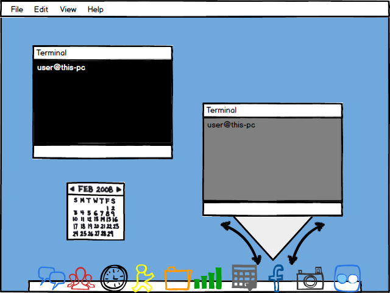

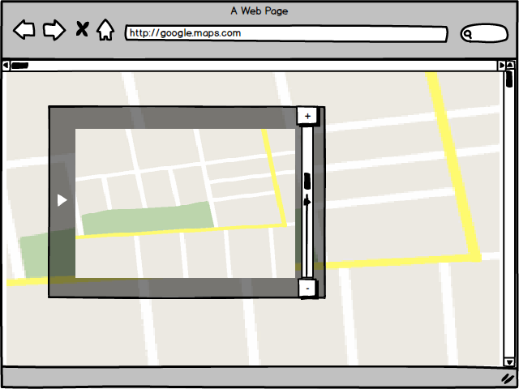

Referencias
-----------

-  Tidwell, J.(2005).Designing Interfaces. Arlington, Massachusetts.
-  Kalbach, J.(2007).Designing Web Navigation. Gravenstein Highway
   North, Sebastopol, CA 95472.
-  Van Welie, M(2008).Obtenida el 19 de Abril del 2015, de
   http://www.welie.com/patterns/showPattern.php?patternID=sitemap-footer/
   -\* Cronin, M.(2009). Obtenida el 19 de Abril del 2015, de
   http://www.smashingmagazine.com/2009/06/17/informative-and-usable-footers-in-web-design/
-  http://ui-patterns.com/patterns/StepsLeft, Obtenida el 19 de Abril
   del 2015. ()
   https://developer.yahoo.com/ypatterns/navigation/bar/progress.html,
   Obtenida el 19 de Abril del 2015.
-  https://developer.yahoo.com/ypatterns/navigation/breadcrumbs.html,
   Obtenida el 19 de Abril del 2015.
-  http://ui-patterns.com/patterns/Breadcrumbs, Obtenida el 19 de Abril
   del 2015.
-  Con la ayuda del siguiente libro se lograron obtener varios patrones
   http://flylib.com/books/en/3.323.1.26/1/
-  Desde la página de Quince.infragistics.com se pudieron conseguir
   algunos modelos de navegación como los siguientes: Clear entry
   points, modal panel,
   http://quince.infragistics.com/#/Search$tag+=Navigation

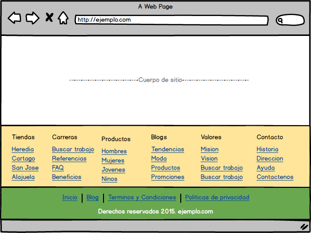
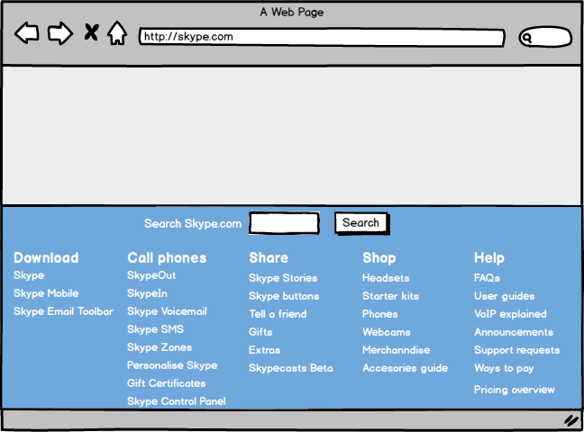
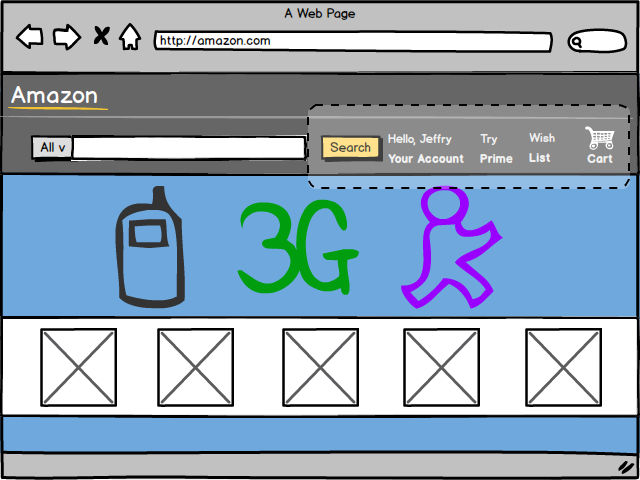
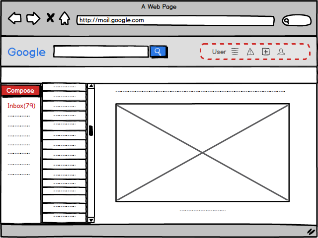
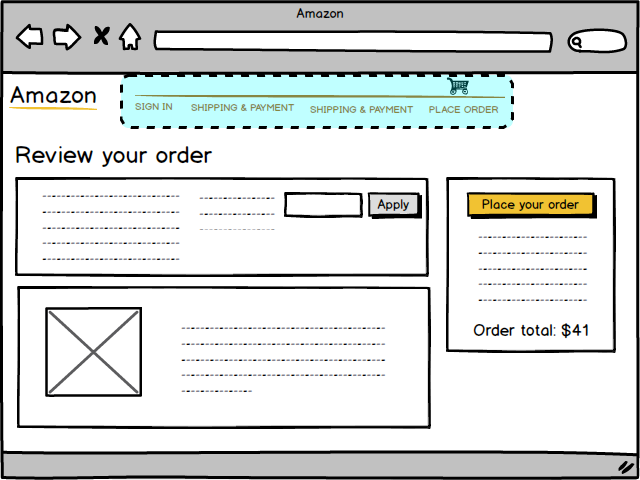
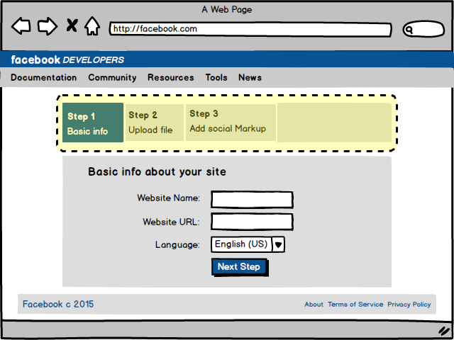
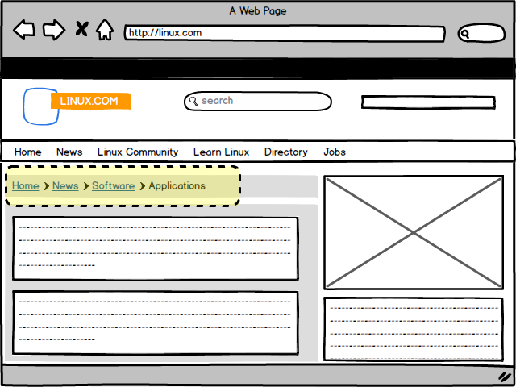
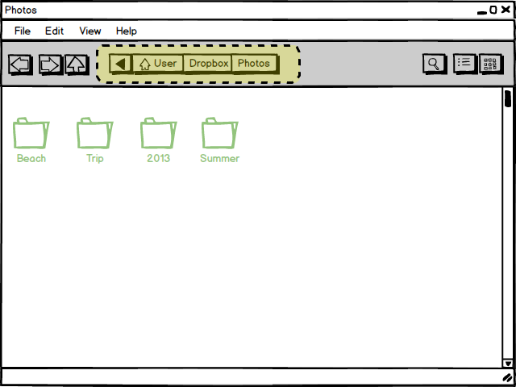
.. |image8| image:: _figures/AnnotatedScrollbar1.png
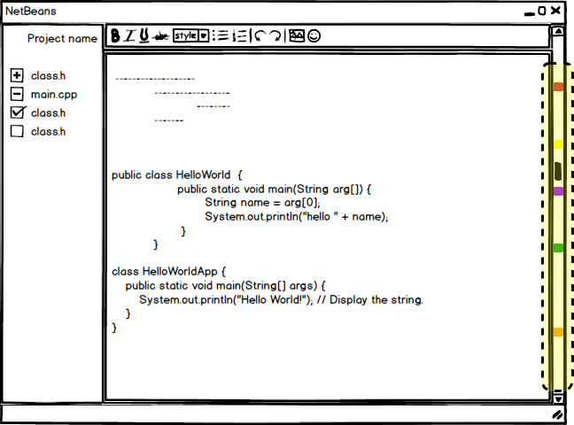
