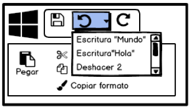

Acciones y comandos
===================

**Recopilado por**: Mauricio González Sánchez y José Pablo Hernández
Hernández

Grupos de Botones
-----------------

En esta técnica se presentan acciones relacionadas como un pequeño grupo
de botones, alineados y con tratamientos gráficos similares. También, se
pueden crear múltiples grupos si hay más de tres o cuatro acciones.

El grupo de botones ayuda a hacer una interfaz auto-descriptiva. Grupos
bien definidos de botones son fáciles de distinguir en un diseño
complejo, y como son bastante visibles, comunican al instante la
disponibilidad de esas acciones.

Características Generales
^^^^^^^^^^^^^^^^^^^^^^^^^

Primero se debe determinar el grupo de los botones a mostrar. Se deben
etiquetar con verbos cortos pero sin ambigüedades o frases verbales, y
no hay que utilizar vocabulario especializado a menos que los usuarios
lo esperen. No se deben mezclar los botones que afectan a cosas
diferentes o tienen distinto alcance, estos se deben separar en
diferentes grupos. Todos los botones del grupo deben tener el mismo
tratamiento gráfico (bordes,color,altura, anchura, estilo de iconos,
efectos dinámicos).

Se pueden alinear en una sola columna, o colocarlos en una sola fila, si
no son demasiado grandes. Si todos los botones de un grupo actúan sobre
el mismo objeto u objetos, se debe poner el grupo de botones a la
izquierda o a la derecha de los objetos. Se podría poner debajo de los
objetos, pero los usuarios tienen a menudo a ver un “puntociego” en la
parte inferior de los elementos de interfaces de usuario complejas, como
las listas de varias columnas y árboles.

Ventajas y Desventajas
^^^^^^^^^^^^^^^^^^^^^^

Es preferible el uso del patrón cuando hay muchas acciones que mostrar
en la interfaz. Se recomienda que todos los botones estén visibles
siempre, sin embargo debe procurarse no saturar la interfaz para evitar
utilizar mas espacio del necesario.

Los grupos de botones bien definidos los hace más visibles y fáciles de
utilizar dentro de una interfaz compleja. Si un grupo de botones actúa
sobre un mismo tipo de objeto, este puede ser colocado a los lados del
objeto; sin embargo debe procurarse que no esconda elementos que
usualmente están presentes en interfaces de usuario complejas.

Ejemplos
^^^^^^^^

   Figura 1

   Figura 2
Herramientas Flotantes
----------------------

Las herramientas flotantes consisten en colocar los botones y otras
acciones junto a los elementos sobre los que actúan, pero ocultos hasta
que el usuario pase el puntero sobre ellos.

Características Generales
^^^^^^^^^^^^^^^^^^^^^^^^^

Se debe diseñar cada elemento o área flotante con suficiente espacio
para mostrar todas las acciones disponibles. Se deben ocultar aquellos
que desordenen demasiado la interfaz, y se mostrarán sólo cuando el
usuario pasa el puntero del ratón sobre el área en cuestión.

Se debe responder rápidamente al puntero del ratón, y no es adecuado
utilizar transiciones animadas, simplemente se deben mostrar las
herramientas de inmediato, y se deben esconder inmediatamente cuando el
usuario mueve el puntero fuera del área del elemento. Del mismo modo,
nunca se debe ampliar el área flotante o reorganizar la página cuando el
usuario pasa el puntero sobre ella. La idea es hacer que la acción de
flotar lo más ligera y rápida posible, de manera que el usuario puede
acceder fácilmente a las herramientas necesarias.

Si el área flotante es un elemento de una lista, es posible que se desee
resaltar el elemento, cambiando su color de fondo o dibujar un borde
alrededor. El acto de mostrar las herramientas llevarán los ojos del
usuario a esa zona, pero resaltando el tema lo hará aún más.

Ventajas y Desventajas
^^^^^^^^^^^^^^^^^^^^^^

Es comúnmente utilizado en interfaces que poseen listas y se muestran
las acciones en cada uno de los elementos. Posee ventaja con respecto a
otros tipos de contenedores de acciones (Action Panel, List Inlay), que
tienen botones que se repiten para cada elemento. No es muy viable
utilizarla en interfaces táctiles ya que requieren que se seleccione el
elemento deseado para mostrar las opciones.

Ejemplos
^^^^^^^^

   Figura 3
.. figure:: _figures/Fig6-04.png
   :alt: Figura 4

   Figura 4
Panel de Acción
---------------

También conocidos como paneles de tareas. Los paneles de acciones son
esencialmente menús que el usuario no necesita mostrar, ellos siempre
están visibles en la interfaz principal. Son un sustituto elegante para
las barras de herramientas cuando las acciones se describen mejor
verbalmente que visualmente. En lugar de usar menús, se presentan un
gran grupo de acciones relacionadas en un panel que los organiza y esté
siempre visible.

Características Generales
^^^^^^^^^^^^^^^^^^^^^^^^^

Es preferible usarlo cuando las acciones (para una lista de elementos)
son demasiadas para agregarlas en forma de Herramientas Flotantes, pero
no se quiere agregar una barra de menú para contenerlas. Las acciones
del panel se pueden estructurar de diferentes formas:

-  Listas simples
-  Listas con columnas múltiples
-  Listas categorizadas
-  Tablas o cuadrículas
-  Árboles
-  Los paneles que se pueden cerrar
-  Cualquier combinación de estos en un panel

Ventajas y Desventajas
^^^^^^^^^^^^^^^^^^^^^^

El Panel de Acción hace que las acciones estén siempre visibles, permite
tener un mayor espacio de interfaz disponible y libertad de
presentación. El Panel de Acción suele necesitar mucho espacio de una
interfaz por lo que no siempre es la mejor opción para dispositivos
pequeños.

Ejemplos
^^^^^^^^

.. figure:: _figures/Fig6-05.png
   :alt: Figura 5

   Figura 5

   Figura 6
Botón "hecho" Prominente
------------------------

En esta técnica se pone el botón que finaliza una transacción al final
del flujo visual; este debe ser grande y bien etiquetado.

Características Generales
^^^^^^^^^^^^^^^^^^^^^^^^^

El botón con que finaliza la transacción debe colocarse al final del
flujo visual debe ser grande y estar bien rotulado. Es preferible
utilizar este patrón cada vez que se necesite un botón *Finalizar*,
*Enviar*, *OK* o *Continuar*.

Para rotular estos botones es recomendable utilizar palabras que definan
exactamente el procedimiento a realizar. Es usual encontrar este tipo de
botones ubicados luego del último paso del procedimiento y alineados a
la derecha de la página.

Se recomienda posicionar el botón exactamente después del último paso
del procedimiento en cuestión, ya que puede que el usuario no lo
encuentre y no se finalice el proceso.

Ventajas y Desventajas
^^^^^^^^^^^^^^^^^^^^^^

El tener un último paso en la transacción da el sentido de terminación.
El usuario entiende que la transacción se realizará cuando se oprima el
botón. Este último paso debe ser muy obvio. Ofrece al usuario la
posibilidad de realizar sus procesos de forma fluida y continua evitando
detenciones no deseadas para buscar el botón para finalizar la acción.

Ejemplos
^^^^^^^^

   Figura 7

   Figura 8
Items de Menú Inteligentes
--------------------------

La técnica de items u opciones de menú inteligentes consiste en cambiar
las etiquetas de los menú dinámicamente para mostrar precisamente lo que
ellos hacen cuando son invocados.

Los elementos de menú que dicen exactamente lo que van a hacer hacen la
interfaz de usuario auto-explicativa. El usuario no tiene que detenerse
y averiguar qué objeto se verá afectado. Es también menos probable que
haga accidentalmente algo que no tenía la intención de hacer. Por lo
tanto, fomenta la exploración segura.

Características Generales
^^^^^^^^^^^^^^^^^^^^^^^^^

Cada vez que el usuario cambia el objeto seleccionado (o documento
actual, última operación de deshacer, etc), se deben cambiar los
elementos del menú que operan en él para incluir los detalles
específicos de la acción. Obviamente, si no hay ningún objeto
seleccionado del todo, se debe desactivar la opción del menú, lo que
refuerza la conexión entre el elemento y su objeto.

Inclusive, este patrón también podría funcionar para las etiquetas de
botones o vínculos, o cualquier otra cosa que es un “verbo”, en el
contexto de la interfaz de usuario. Las acciones a las que se le aplica
este patrón suelen ser específicas para cada tipo de elemento que posee
la interfaz.

Ventajas y Desventajas
^^^^^^^^^^^^^^^^^^^^^^

Este patrón también puede ser aplicado en botones, vínculos o casi
cualquier elemento de la interfaz sea señalizado con un verbo. Debe
estar bien definido el elemento de la interfaz que se ha seleccionado y
definir correctamente las acciones que aplican al elemento, esto para
evitar que el usuario aplique estas acciones en elementos no deseados.

Ejemplos
^^^^^^^^

   Figura 9

   Figura 10
Vista Previa
------------

Esta técnica muestra a los usuarios una vista previa o resumen de lo que
va a pasar cuando se realiza una acción.

Una vista previa ayuda a evitar errores. Un usuario puede haber cometido
un error, o que pudo haber malinterpretado algo que dio lugar a la
acción de que se trate. Por lo que mostrar un resumen o una descripción
visual de lo que está a punto de suceder, le da una oportunidad de
volver atrás y corregir cualquier error. La vista previa también pueden
ayudar a las aplicaciones a ser más auto-descriptivas.

Características Generales
^^^^^^^^^^^^^^^^^^^^^^^^^

Justo antes de que el usuario realice una acción, se debe mostrar toda
la información que le de una visión clara de lo que está a punto de
suceder. Si se trata de una vista previa de impresión, se debe mostrar
cómo se vería la página en el tamaño de papel elegido, y si es una
operación sobre una imagen, se debe mostrar un primer plano de cómo se
verá la imagen, y si se trata de una transacción, se debe mostrar un
resumen de todo lo que el sistema sabe acerca de esa transacción.

Mostrar lo que es importante, ni más ni menos. Se debe dar al usuario
una forma de ejecutar la acción directamente desde la página de vista
previa. No hay necesidad de hacer que el usuario cierre la vista previa
o navegue a otro lugar. Del mismo modo, se debe ofrecer al usuario una
forma de volver atrás.

Ventajas y Desventajas
^^^^^^^^^^^^^^^^^^^^^^

Se utiliza cuando el usuario esta a punto de realizar una acción muy
pesada y se desea tener una vista previa para comprobar que lo que esta
haciendo esta correcto.Puede poseer opciones adicionales a las que
ofrece el programa tales como cambios visuales, como aplicar un filtro a
una foto, o revisiones generales (revisiones de texto).

Previene al usuario de errores, al mostrarle un resumen o una
descripción visual de lo que esta realizando, se le brinda la opción de
corregir los errores. En caso de que la vista previa muestre información
incorrecta o esta no sea correctamente mostrada puede impulsar al
usuario a realizar una acción de una manera no deseada o hasta que no la
realice del todo.

Ejemplos
^^^^^^^^

   Figura 11

   Figura 12
Indicador de Progreso
---------------------

El indicador de progreso muestra al usuario cuanto progreso fue
alcanzado en una operación que consume mucho tiempo. Esta técnica se
utiliza en acciones que consumen mucho tiempo (más de 2 segundos) o para
acciones que se ejecutan en segundo plano (background).

Características
~~~~~~~~~~~~~~~

Se puede mostrar un indicador animado de cuánto progreso a sido
realizado. Estudios muestran que si los usuarios ven un indicador de
cuánto falta, ellos tienden a ser más pacientes. Este elemento le dice
al usuario:

-  Qué está sucediendo.

-  Qué proporción de la operación ha sido completada

-  Cuánto tiempo falta

-  Cómo detenerlo

Ventajas y Desventajas
~~~~~~~~~~~~~~~~~~~~~~

El usuario se siente impaciente cuando parece que la aplicación no hace
nada. Aunque el puntero cambie por un reloj, el usuario no quiere
esperar por un tiempo indeterminado.

Ejemplos
^^^^^^^^

   Figura 13

   Figura 14
Cancelabilidad
--------------

La cancelabilidad consiste en proporcionar una forma de cancelar al
instante una operación que consume tiempo, sin efectos secundarios.

Características
~~~~~~~~~~~~~~~

Una operación que consume tiempo interrumpe la interfaz de usuario, o se
ejecuta en segundo plano, por más tiempo de dos segundos o menos; por
ejemplo, cuando se imprime un archivo, consultar una base de datos, o
cargar un gran archivo.

Alternativamente, el usuario se dedica a una actividad que cierra
literalmente o aparentemente las demás interacciones con el sistema,
como por ejemplo cuando se trabaja con un cuadro de diálogo modal.

Ventajas y Desventajas
~~~~~~~~~~~~~~~~~~~~~~

Los usuarios cambian de opinión. Una vez que se inicia una operación que
consume tiempo, un usuario puede querer detenerla, especialmente si un
indicador de progreso le dice que va a tomar un tiempo. O el usuario
puede haberla iniciado por accidente.

La cancelabilidad ayuda a la prevención y recuperación de errores, el
usuario puede cancelar algo que sabe que va a fracasar, como la carga de
una página de un servidor web que se da cuenta que esta caído. En
cualquier caso, el usuario se sentirá mejor acerca de la exploración de
la interfaz y probará cosas si sabe que todo es cancelable. Esta técnica
alienta la exploración segura, que a su vez hace que la interfaz sea más
fácil y divertida de aprender.

Ejemplos
^^^^^^^^

   Figura 15

   Figura 16
Deshacer multinivel
-------------------

La técnica de deshacer multinivel provee una forma de deshacer
fácilmente una serie de acciones ejecutadas por el usuario.

Características
~~~~~~~~~~~~~~~

Generalmente esta técnica se aplica en interfaces complejas.Interfaces
de usuario más complejas que la simple navegación o formulario. Esto
incluye los lectores de correo, software de base de datos, herramientas
de autor, software de gráficos y entornos de programación.

En concreto, se espera que este tipo de cambios sea posible en la
mayoría de las aplicaciones:

-  Ingreso de texto para documentos u hojas de cálculo
-  Transacciones de bases de datos
-  Las modificaciones a las imágenes o lienzos de pintura
-  Disposición cambios-posición, tamaño, orden de apilamiento, o
   aplicaciones gráficas
-  Las operaciones de archivo, como eliminar o modificar archivos
-  Creación, supresión o reorganización de objetos tales como mensajes
   de correo electrónico o de cálculo columnas de hoja
-  Cualquier cortar, copiar o pegar elementos

Ventajas y Desventajas
~~~~~~~~~~~~~~~~~~~~~~

Esta habilidad de deshacer una larga secuencia de operaciones le per-
mite al usuario sentir que la interfaz es segura de explorar.

De esta forma el usuario puede aprender de la interfaz, y experimentar
con ella con la confianza que cualquier operación equivocada puede ser
deshecha.

Ejemplos
^^^^^^^^

   Figura 17

   Figura 18
Historia de Comandos
--------------------

Con la técnica del historial de comandos conforme el usuario ejecuta
acciones, se mantiene un registro visible de lo que fue hecho, a qué y
cuando.

Características
~~~~~~~~~~~~~~~

Esta técnica generalmente se usa cuando el usuario ejecuta secuencias
complejas de acciones, ya sea a través de un interfaz gráfica o mediante
la línea de comandos. En editores gráficos y los ambientes de
programación se usa comúnmente esta técnica.

Ventajas y Desventajas
~~~~~~~~~~~~~~~~~~~~~~

Algunas cosas que puede necesitar el usuario son:

-  Repetir una acción o comando hecho anteriormente, o que no recuerda
   bien.
-  Recordar el orden en que algunas acciones fueron hechas.
-  Repetir una secuencia de operaciones, originalmente realizadas en un
   objeto, sobre otro objeto.
-  Mantener una bitácora de sus acciones, para propósitos legales o de
   seguridad.

Los ordenadores son buenos para mantener un registro exacto de las
medidas adoptadas; la gente no lo es, hay que tomar ventaja de eso.

Ejemplos
^^^^^^^^

   Figura 19

   Figura 20
Macros
------

Las macros son acciones simples compuestas de otras acciones más
pequeñas. Los usuarios pueden crearlas agrupando secuencias de acciones.

Este mecanismo se utiliza cuando el usuario quiere repetir una larga
secuencia de acciones o comandos. Por ejemplo, pasar a través de una
lista de archivos, imágenes, registros de una base de datos, u otros
objetos; haciendo las mismas cosas en cada objeto.

Características
~~~~~~~~~~~~~~~

Los macros pueden tener parámetros que pueden ser usados para modificar
su aspecto y su comportamiento.

Pero los macros además pueden tener un conjunto de funciones y
algoritmos propios que les pueden otorgar una funcionalidad predefinida
y/o modificable.

El mecanismo consiste de dos operaciones: definir la macro y ejecutar la
macro.

Ventajas y Desventajas
~~~~~~~~~~~~~~~~~~~~~~

Las macros ayudan a que el usuario trabaje más rápido y al mismo tiempo
disminuyen la cantidad de errores de digitación.

Al comprimir una larga secuencia de acciones en un sola, el usuario
puede mantener su concentración en la meta a largo plazo en lugar de
preocuparse en los detalles.

Ejemplos
~~~~~~~~

   Figura 21

   Figura 22
Bibliografía
------------

[1] José Luis Abreu León. (2014). Macros. 14/04/2015, Obtenido de
http://arquimedes.matem.unam.mx/Descartes4/doctec/doc/Macros.html

[2] Vista Previa. 19/04/2015, Obtenido de
http://ui-patterns.com/patterns/LivePreview
