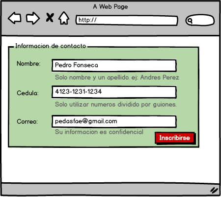
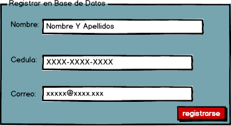

Formularios y controles
=======================

**Recopilado por**: Edgar Bello y José del Valle

Forgiving Format (Olvidando el Formato)
---------------------------------------

Este patrón se refiere a que el usuario pueda ingresar información sin
necesidad de tener un formato específico, el sistema analiza y utiliza
el formato más adecuado dependiendo del ingreso del usuario, así el
usuario no tiene que preocupar se por el formato, o que tenga que
esperar mensajes de error por medio del formato que ingreso. Además el
diseñador ahora espacio por medio de que no tiene que tener varias
entradas que le pidan información al usuario sino solo una entrada
general. Este patrón tiene la característica que se da cuando varias
entradas tienen una acción que llevan a lo mismo, como por ejemplo
buscar por nombre, apellido o número de cédula, al final dan con el
mismo Usuario.

Ventaja
~~~~~~~

En vez de utilizar varios formularios que al final den la misma
información, se utiliza uno que pueda aceptar las entradas de los demás
y así se ahorra espacio en la interfaz y tiempo de llenado para el
usuario.

Desventaja
~~~~~~~~~~

No son buenos para casos donde se necesite algo específico, o la
información que se busca no sea de fácil acceso, por lo que dividir
entre diferentes formularios podría facilitar el ingreso o búsqueda.

Ejemplos
~~~~~~~~

1. En este ejemplo se muestra cómo se pueden ingresar nombres y también
   códigos postales (números), el sistema define inteligentemente que es
   de lo que se le esta ingresando y escoge el formato requerido.

2. En este ejemplo se puede ver como en web hay varias empresas que
   utilizan este patrón como en este caso Facebook donde si uno ingresa
   el nombre, el apellido, el correo entre otros, este nos busca la
   persona que intentamos ver, como se puede ver en el ejemplo no se
   necesita tener un formato en si el sistema inteligentemente lo
   averigua y busca lo solicitado.

Structured Format (Formato Estructurado)
----------------------------------------

Este patrón de diseño, explica que cuando un usuario necesita ingresar
cierta información con un tipo de estructura diferente o especifico, se
puede utilizar otras entradas y acomodar las de forma que el usuario
pueda ver el formato de una forma simple y ligera, así el usuario no se
preocupa tanto por como es el formato.

Ventaja
~~~~~~~

El usuario puede ver rápidamente que es lo que se le solicita, como
cuando se va a ingresar un numero de teléfono o una cédula, donde se
puede dividir en diferentes grupos de números, así el usuario sabe el
tamaño que busca el formato de una forma rápida y sencilla.

Desventaja
~~~~~~~~~~

Este patrón solo sirve para grupos con información estructurada de una
forma igual, no se puede hacer general ya que puede haber grupos donde
no se utilicen los teléfonos o cédulas con el mismo formato.

Ejemplos
~~~~~~~~

1. Se muestra como se estructura el nombre, la fecha de nacimiento, la
   cédula y la tarjeta de crédito para que el usuario vea como se
   dividen las partes.

.. figure:: _figures/ejemplo2.png
   :alt: 

2. Otro ejemplo es cuando ingresamos la clave de algun software, muchos
   utilizan estructuras para que el usuario conozca la forma de la
   clave.

Fill-in-the-Blanks (Llenar espacios en blanco)
----------------------------------------------

Se utiliza cuando se quiere información del usuario que se puede ir
llenando de forma secuencial conforme a las entradas. Se busca que el
usuario pueda ser guiado de una forma clara a la hora de llenar los
espacios en blanco conforme a lo que se le solicita al usuario. Se
utilizan muchas etiquetas para ir guiando al usuario.

Ventaja
~~~~~~~

Sirve para aclarar que tiene que llenar el usuario mediante una guía
rápida con etiquetas fáciles de colocar, además de que no sobrecargan el
espacio de los formularios.

Desventaja
~~~~~~~~~~

No son muy útiles cuando se busca llenar muchos espacios donde algunos
no son necesarios.

Ejemplos
~~~~~~~~

1. En el siguiente ejemplo se muestra como el usuario va llenando
   espacios en blanco con la intención de poder llenar un contrato.

2. En este ejemplo se puede ver como el usuario va llenando las compras
   para que luego el sistema le indique el costo, se va guiando al
   usuario con los espacios en blanco así el usuario puede ver que está
   haciendo y de donde vienen los precios.

Input Hints (Ayuda en las entradas)
-----------------------------------

Son ayudas extra visibles sobre o debajo de espacios de ingreso en
blanco, esto para que el usuario tenga mejor conocimiento de que es lo
que se le está pidiendo. Lo que se busca es poner una pequeña
explicación o también ejemplos de lo que se espera en la entrada,
también se utilizan para dar información extra de lo que se va a
utilizar de la información, por ejemplo la privacidad de la clave o
formato de la clave.

Ventaja
~~~~~~~

Deja un poco más claro que es lo que el usuario debe ingresar evitando
errores.

Desventaja
~~~~~~~~~~

Puede sobrecargar los espacios de ingreso de información, además de que
depende del espacio pueden estar de más.

Ejemplos
~~~~~~~~

1. Se muestran ayudas de texto debajo de las entradas para que el
   usuario tenga más información tanto de lo que va a ingresar como de
   información de interés del contacto como seguridad de su información.

2. En este ejemplo se puede ver como al ingresar un usuario a una página
   o un sistema, la información del usuario puede tener un formato donde
   se puede dar un mensaje de ayuda al usuario debajo de las entradas, o
   también se puede redirigir al usuario a otra página que le de ayuda a
   su problema.

Input Prompt (Entradas con pre ingresado de ayuda)
--------------------------------------------------

Cuando las etiquetas de las entradas no son 100% claras, se utilizan
palabras o frases pre-seleccionadas en las entradas para dejar más claro
lo que se necesita en cada entrada. Muchas veces el usuario no entiende
con solo nombrar el formato, también necesita de ejemplos para que pueda
ver y entender de forma fácil lo que se le está pidiendo y con el
formato. Este patrón ayuda a ahorrar espacio dando el ejemplo en el
mismo lugar donde el usuario va a ingresar información.

Ventaja
~~~~~~~

Cuando un usuario no está seguro de lo que debe de ingresar, se puede
mostrar un pequeño ejemplo básico de lo que debería de ingresar con el
formato requerido. Puede ser un texto, números, correos, entre otros, a
un color diferente u otras formas. Lo que se busca es un rápido
reconocimiento de lo que el usuario debería de ingresar sin que tome
mensajes o muchas otras etiquetas que puedan sofocar la interfaz del
usuario, sirve en espacios pequeños donde se puede meter información con
formatos definidos.

Desventaja
~~~~~~~~~~

No toda entrada necesita tanta explicación, si se manejan mal se sobre
carga la interfaz de información innecesaria.

Ejemplos
~~~~~~~~

1. Se muestra como se utiliza texto pre ingresado en las entradas para
   indicar a los usuarios como debe ser la información que se le está
   pidiendo, además ayuda a mostrar la estructura de la información.

2. En este caso cuando un usuario intenta reservar una habitación en un
   hotel, se le pide información que en las partes de entrada se puede
   ver un ejemplo o una leyenda que le indique al usuario que es lo que
   se interesa ingresar en el espacio, como también el formato de lo
   deseado.

Password Strength Meter
-----------------------

Este patrón busca darle a conocer al usuario que tan buena es la
contraseña que está ingresando. Cuando un usuario ingresa una contraseña
sin este patrón, no se da cuenta de que tan segura puede ser su
contraseña, lo único que lo puede ayudar es el formato de la contraseña
en sí, pero puede ser tan fácil como el usuario lo permita. Cuando se le
muestra al usuario que tan segura es la contraseña que acaba de escribir
de una forma rápida y sencilla, el usuario puede cambiar su contraseña o
buscar agregarle dificultad por medio de formatos más difíciles, así
garantizando que las contraseñas no sean de fácil acceso.

Ventaja
~~~~~~~

Permite que el usuario vea rápidamente que tan fuerte, así el usuario no
tiene que esperar y ver errores hasta después de ingresar toda la
información. Esto permite que el usuario se concentre en una sola tarea
y cuando ya termine con la parte de la contraseña pueda continuar con lo
demás, sabiendo que la nueva contraseña es suficientemente segura.

Desventaja
~~~~~~~~~~

Un problema que se da es que por buscar hacer la contraseña con mayor
dificultad y mayor seguridad, puede que el usuario le cueste más
recordar la contraseña y olvide detalles de la estructura haciendo que
tenga que volver a ingresar una nueva después.

Ejemplos
~~~~~~~~

1. Un ejemplo muy común, es cuando se registra una contraseña nueva,
   cuando se digita se muestra que tan segura es la contraseña
   ingresada, informando de inmediato al usuario de que tan segura puede
   ser su contraseña, así el usuario se garantiza una buena contraseña.

2. En el segundo caso se toma como mensaje de la contraseña que
   características debería de tener la contraseña para así mantener una
   contraseña mas segura, este indica si debería de tener otros
   caracteres.

Autocompletar
-------------

Se autocompletar un campo de texto mientras el usuario escribe en este,
anticipando posibles respuestas y mostrándolas en una lista.

Características
~~~~~~~~~~~~~~~

Se utiliza cuando el usuario escribe algo que se puede predecir, como
una URL, nombres, fechas o direcciones. Las predicciones pueden venir de
una lista de búsquedas previas, o de una lista predefinida. Este patrón
facilita el uso de campos de búsqueda de diferentes tipos o formularios.

El uso de éste patrón ahorra tiempo al usuario, así este no tiene que
escribir más de lo necesario cuando la lista muestra la respuesta que
éste busca, especialmente con URLs muy largas o direcciones de correo
que pueden ser olvidadas, se previenen también errores, una hilera de
texto larga tiene mas probabilidades de tener un error, que con entradas
autocompletadas no suceden.

En dispositivos móviles es mucho mas útil, debido a que escribir en
éstos toma mas tiempo y se cometen mas errores que el autocompletar
soluciona, ahorrando tiempo y frustración.

También está presente en editores de texto y líneas de comandos. A la
hora que el usuario escribe, la aplicación o consola puede ofrecer
sugerencias para completar lo que se esté escribiendo.

Los motores de búsqueda utilizan este patrón desde que se empieza a
escribir, mostrando una lista con sugerencias que otras personas buscan
o con contenido disponible.

Con cada letra que el usuario escribe, el programa forma una lista de
sugerencias que puedan completar la palabra o línea de texto, otras
sugerencias pueden ser lineas ingresadas por el usuario previamente,
almacenadas en un historial; pueden ser también frases comúnmente
ingresadas previamente por otros usuarios; posible contenido siendo
buscado en la página, que puede contener la letra o palabra que el
usuario escribe; y por ultimo listas de contactos o correos
electrónicos.

Presenta las ventajas de que ahorra tiempo y esfuerzo al usuario,
recuerda al usuario líneas de texto que tal vez haya olvidado y ofrece
al usuario búsquedas comunes que realizan otros usuarios.

Se debe de ser cuidadoso con el uso de este patrón, ya que el éxto de
las sugerencias depende del algoritmo usado por el programador y que
sugerencias incorrectas podrían irritar al usuario.

Ejemplo
~~~~~~~

Un campo de búsqueda de correos que muestra sugerencias según las letras
que escribe el usuario.

Un sitio web en el que se buscan tiquetes aéreos, con dos campos de
búsqueda para ingresar las ciudades de origen y destino, ambas
utilizando el patrón de autocompletar.

Selector Dropdown
-----------------

Menú en forma de drop-down o pop-up que extiende las capacidades de
selección de objetos.

Características
~~~~~~~~~~~~~~~

Se utiliza cuando el usuario necesita seleccionar una opción de un grupo
grande, como la selección de colores, una fecha en un calendario o un
número, entre otros, sin tener que ocupar ese espacio en la página o
contenedor principal.

Fáciles de entender si provienen de un icono como una flecha o un cuadro
de color, que signifique la apertura del drop down con más opciones. Los
drop-downs ademas funcionan como una interfaz de usuario adicional en un
espacio pequeño, sin tener que comprometer la página principal, puesto
que solo aparecen cuando el usuario lo desea.

Cuando el drop-down se encuentra cerrado, se muestra un ícono pequeño
con la selección o valor actuales, puede tener una flecha a la par o ser
un ícono por si solo, siendo clickeado se abrirá el selector con las
demás opciones, se cierra al seleccionar una o clickear el ícono de
nuevo.

Este debe de ser pequeño y su organización visual debe de ser de formato
familiar como una lista, tabla, un calendario, o calculadora. Links o
botones en el selector pueden abrir interfaces secundarias.

El selector puede comportarse de tal manera que muestre las selecciones
recientes o mas utilizadas por el usuario.

Ofrece las ventajas de que ahorra espacio en la interfaz, al esconder el
menu y amplía las capacidades de selección, dando al usuario muchas
opciones específicas en un espacio dedicado.

No incrementa la usabilidad de la página, puesto que a veces puede ser
complicado de usar si no se tiene el cuidado a la hora de colocarlo en
la página, y de como éste luzca.

Ejemplo
~~~~~~~

Un selector de fecha, que aparece al clickear un icono con la forma de
un calendario.

Un menú dropdown en una aplicación móvil, que despliega todas las
selecciones posibles.

Constructor de listas
---------------------

Muestra listas de fuente y destino en una misma página, y permite al
usuario mover objetos entre las dos listas, arrastrándolos o mediante
botones.

Características
~~~~~~~~~~~~~~~

Se utiliza cuando se le solicita al usuario crear una lista de objetos,
seleccionando elementos de otra lista.

Mostrar las dos listas en un solo lugar ayuda al usuario a observar las
dos al mismo tiempo y conocer su estado actual, ademas de evitar que
este tenga que brincar entre diferentes vistas para ver cada lista.
También presenta la ventaja de que facilita la transferencia de datos
entre dos lisas.

Colocando ambas listas (de fuente y destino) una al lado de la otra, o
una debajo de la otra; entre ellas colocar botones para añadir o remover
los elementos de ambas listas, o por medio de drag and drop. Dependiendo
de las listas y la funcionalidad, se puede o no eliminar el elemento de
la lista fuente a la hora de agregarla a la de destino. Es importante
que las listas posean selección múltiple, permitiendo al usuario
seleccionar muchos elementos en lugar de uno por uno.

Ejemplo
~~~~~~~

Una selección de elementos que utiliza drag and drop o botones en ambos
sentidos para agregar o eliminar una imagen de la galería de destino.

Buenos valores por defecto
--------------------------

Llenar campos en formularios con valores que el usuario quiere o podría
querer ingresar.

Características
~~~~~~~~~~~~~~~

Se utiliza cuando se le solicita al usuario responder preguntas en un
formulario de texto o check-boxes y se quiere reducir el tiempo o
trabajo para los usuarios. Para preguntas técnicas o semi relevantes el
usuario podría no saber o importarle la respuesta y elegiría lo que sea
que el sistema sugiera.

Proporcionar respuestas por defecto es de cuidado, si las respuestas son
sensibles como claves de acceso, género de la persona o ciudadanía.
Asumir tales datos podría poner incómodo al usuario, como por ejemplo un
check-box activado por defecto para enviar publicidad al correo.

Proporcionar respuestas por defecto razonables, se ahorra trabajo al
usuario, así este no tiene que pensar tanto ni escribir una respuesta
completa. Si la respuesta por defecto no es lo que el usuario esperaba,
por lo menos le da una idea a este de que información proporcionar.

Rellenar previamente campos de texto, formularios, combo-boxes o otros
controles con un valor por defecto razonable, sugerencias en lugares
innecesarios pueden irritar al usuario. También el sistema puede inferir
datos, dada una respuesta del usuario, como por ejemplo, rellenar los
campos de ciudad o país, dado un código postal.

El usuario podría olvidar una respuesta proporcionada por defecto sin
entender las consecuencias de esto, como por ejemplo una pregunta de
seguridad para recuperar una clave.

Ejemplo
~~~~~~~

Un instalador de una aplicación, que sugiere por defecto una ruta de
instalación para ésta, con la ventaja de que la mayoría de usuarios
nunca cambia esa ruta.

Un sitio web para comprar automóviles, el cual por defecto ofrece un
rango de precios y un año del vehículo determinados.

Mensajes de error en la misma página
------------------------------------

Aparecen mensajes de error en la misma página de un formulario, con
indicadores a la par de donde se origina el error.

Características
~~~~~~~~~~~~~~~

Se utiliza en formularios donde el usuario pueda ingresar datos que no
son aceptados, cuando se pueda olvidar de llenar un campo, direcciones
de correo inválidas, entre otros. Se busca incentivar al usuario a
intentarlo de nuevo. Se busca señalar errores antes de que conviertan en
un problema.

Se facilita al usuario leer el mensaje de error en la misma página, y le
permite a este realizar las correcciones de una manera fácil. Aun mejor
es cuando los mensajes de error se encuentran al lado de los controles
donde ocurrió el error. Da una idea al usuario de que tipo de error
sucedió, debido a los datos ingresados en un campo en específico y se
evita que se ingresen datos incorrectos que puedan afectar el
funcionamiento de la aplicación.

Primero que nada, se debe diseñar el formulario para prevenir errores,
usando los patrones vistos previamente en los campos donde sea
necesario. Si ocurre un error, se debe mostrar un mensaje arriba del
formulario, aun cuando se coloca un mensaje de error al lado del campo
donde éste se origina. Importante que sea arriba puesto que el usuario
es lo primero que ve. Agregar un ícono de alerta para que sea mas
reconocible y utilizar una letra mas grande en color rojo. Al lado de
los campos que causan el error, se debe poner mensajes mas específicos.

Toda validación que se pueda hacer del lado del cliente agilizará el
proceso. Los mensajes de error deben ser cortos y detallados, en
lenguaje común y educados, en caso contrario podrían no ser entendidos
por el usuario, o ser una molestia para éste.

Ejemplo
~~~~~~~

Una sección de login o inicio de sesión en un sitio web, que despliega
un error si alguno de los datos ingresados es incorrecto.

Una sección de creación de usuario en un sitio web, que despliega un
error si la verificación de contraseña no coincide.

Bibliografía
------------

1. Ui-Patterns.com, Forgiving Format, Extraído el dia 11-04-2015,
   http://ui-patterns.com/patterns/ForgivingFormat

2. Ui-Patterns.com, Structured Format, Extraído el dia 11-04-2015,
   http://ui-patterns.com/patterns/StructuredFormat

3. Ui-Patterns.com, Fillin The Blanks, Extraído el dia 11-04-2015,
   http://ui-patterns.com/patterns/FillInTheBlanks

4. Ui-Patterns.com, Input Prompt, Extraído el dia 11-04-2015,
   http://ui-patterns.com/patterns/InputPrompt

5. Ui-Patterns.com, Password Strength Meter, Extraído el dia 11-04-2015,
   http://ui-patterns.com/patterns/PasswordStrengthMeter

6. Tidwell, J. (2010). Designing interfaces. " O'Reilly Media, Inc.".

7. Getelastic.com, Form Design: 11 Patterns For Accepting User Input,
   Extraído el dia 19-04-2015,
   http://www.getelastic.com/form-design-11-patterns-for-accepting-user-input/

8. Imagen logo Universidad Nacional: http://images.frompo.com/i/una.edu.

