Diseño móvil
============

**Recopilado por**: Elizabeth Jiménez y Roberto Morales Jiménez

Filmstrip (Tira de película)
----------------------------

El patrón Filmstrip (Cinta de película) es esencialmente un Carrusel, se
usa para una rápida navegación con el objetivo que el usuario se deslice
entre las páginas de nivel superior y pueda ver el contenido de las
mismas una a la vez.

Este patrón se asemeja mucho al patrón de navegación secundaria Page
Carousel (Neil,2012:30).

    *"En dispositivos móviles, una tira de película es de manera similar
    una serie de pantallas, mostrada como una tira continua, con
    espacios pequeños o marcadores entre ellos. Cuando se centra una
    pantalla en particular, se llena toda la ventana gráfica.”* (4ourth
    mobile)

Características
~~~~~~~~~~~~~~~

-  Un conjunto de información que puede ser presentada como un conjunto
   de imágenes para la visualización y selección
-  Es soportada en varios sistemas operativos móviles y plataformas de
   programación
-  Una tira de película es de manera similar una serie de pantallas,
   mostrada como una tira continua, con espacios pequeños o marcadores
   entre ellos.
-  Se utiliza este patrón en particular cuando las informaciones que se
   desea presentar son conceptualmente paralelas, es decir tiene
   relación entre ellas.

Ventajas
~~~~~~~~

-  Fácil deslizamiento entre contenidos.

-  Una manera sencilla para ver una presentación de diapositivas.

Desventaja
~~~~~~~~~~

Puede ser difícil de utilizar este patrón en particular en ciertas
plataformas, tales como dentro de las páginas web, debido a las
condiciones de desplazamiento de las mismas.

No se pueden utilizar demasiadas página de nivel superior, también los
usuarios se podrían molestar si la cinta de película es muy larga; esto
debido a que se deberá durar más tiempo para llegar al punto deseado.

Ejemplos
~~~~~~~~

1. A continuación se presenta una aplicación móvil de una tienda de
   venta de zapatos para mujer, el cual implementa el patrón de
   filmstrim (tira de película) para poder desplazarse entre los
   diferentes estilos de zapato que la tienda ofrece y así de esta
   manera es más sencilla la visualización de los zapatos y presenta la
   información detallada del mismo.

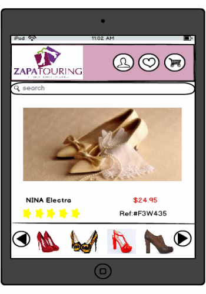

2. Este segundo ejemplo presenta la aplicación móvil de una cadena de
   deportes, el cual implementa el patrón para poder desplazarse entre
   las noticias deportivas con el simple acto de deslizar con el dedo
   las imágenes presentadas en la tira de película. De esta manera el
   usuario puede moverse entre las noticias de una manera sencilla hasta
   encontrar una de su interés.

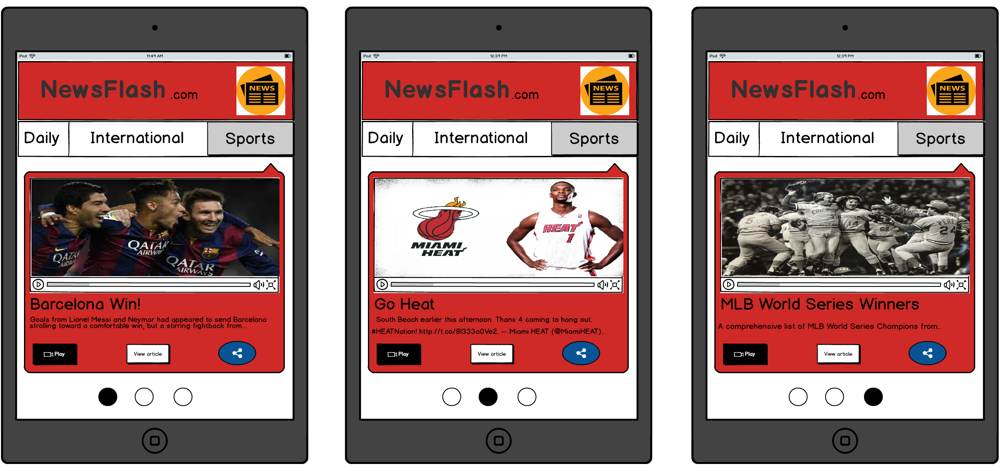

Bottom Navigation (Navegación a pie de página)
----------------------------------------------

Crea un conjunto de elementos de menú dispuestas verticalmente en la
parte inferior de la página, en vez de ocupar demasiado espacio al tope
de la página para la navegación, se puede empujar la navegación global a
la parte inferior de la página para hacer que encaje en un espacio
compacto.

Cabe destacar que este patrón se encuentra estrechamente relacionado con
el patrón Sitemap Footer. ( Tidwell,2011:110)

Características
~~~~~~~~~~~~~~~

-  Vínculos globales de navegación
-  Crear un conjunto de elementos de menú colocados verticalmente en la
   parte inferior de la página.
-  Para los teléfonos móviles con touch screens, resulta muy sencillo el
   hecho de seleccionar los elementos del menú de navegación.
-  Disminuye la utilización del tope de la página, empujando los links
   de navegación hacia la parte inferior de la página.

Ventajas
~~~~~~~~

Crean en la parte inferior de la página el menú de navegación dejando
libre la parte superior de la misma con el objetivo de no interferir con
los contenidos esenciales de la página.

En vez de tomar mucho espacio en la parte superior da la página, la cual
es la más valiosa, se desplaza a la parte inferior de la página los
links para la navegación.

Desventajas
~~~~~~~~~~~

Si se abusa de este patrón y se trata de integrar muchos links de
navegación en la parte inferior, podría dificultar la selección de los
mismos debido al espacio que existiría entre ellos.

Ejemplos
~~~~~~~~

1. El ejemplo que se muestra a continuación representa una aplicación
   móvil para la reproducción de música, en el menú de navegación a pie
   de página se presentan las opciones de regresar, avanzar y
   seleccionar una canción. De esta manera toda la información valiosa
   de las canciones, álbumes y artistas no quedan obstruidas.

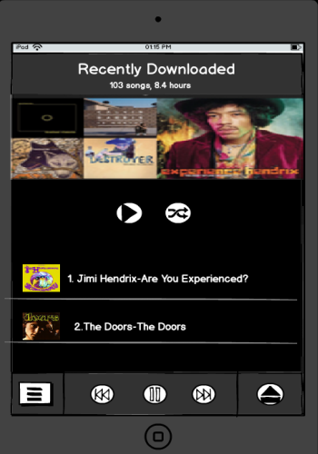

2. El ejemplo presenta una aplicación de contenido social, el cual el
   usuario en la parte inferior de la página puede seleccionar las
   diferentes opciones que le permite la aplicación tales y navegar por
   la misma con este pequeño menú que simplifica muchas de las opciones
   que ofrece y resulta útil para la navegación dentro de la aplicación.

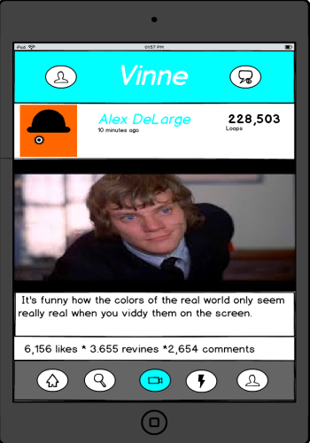

Infinite List (Lista infinita)
------------------------------

La carga inicial de una página es rápida y contiene algunos elementos
así el usuario no percibe la espera de cargar todos los elementos de una
vez, cada carga posterior de un nuevo trozo de elementos también es
rápido, y el usuario controla cuando necesita cargar más elemento.

Es muy similar a la lista vertical con la principal diferencia de que
sólo una parte de la lista es inicialmente cargada.

En el fondo de una larga lista, se añade un botón para recuperar y
mostrar una menor cantidad de cargas de la información y añade a la vez
más elementos a la lista. El primer conjunto que se muestra llenará la
ventana gráfica.

Este concepto del manejo de listas en el campo de la ingeniería de
software es llamada: lazy loading-carga
perezosa/diferida.(Neil,2012:94).

Características
~~~~~~~~~~~~~~~

-  Carga y agrega más elementos a la lista cuando se solicite.
-  Realiza búsquedas profundas
-  Cuando al cargar una larga lista el conjunto de información es muy
   grande y se necesite hacer una búsqueda más adelante hasta alcanzar
   el objetivo de búsqueda del usuario.

Ventajas
~~~~~~~~

Despliega inicialmente los resultados de una búsqueda y carga
posteriormente un nuevo trozo de elementos rápidamente.

El usuario carga los elementos cuando los necesite, controlando de esta
manera el desplegar datos innecesarios y no solicitados.

El usuario nunca tiene que realizar un cambio de contexto Para ir a una
nueva página y realizar una nueva búsqueda de nuevos elementos

Desventaja
~~~~~~~~~~

Muchas listas, como las listas de contactos, pueden existir para el
usuario con casi ningún contenido o con miles de articulos.se deben
tener en cuenta estas consideraciones la hora de seleccionar este
patrón, debido a que tiene que saber cómo manejar los dos tipos de
situaciones.( Hoober,2011:72)

Ejemplos
~~~~~~~~

1. A continuación se presenta la aplicación móvil de una tienda
   departamental la cual vente una serie de artículos relacionada con la
   electrónica entre otros. Al lado de cada ítem se muestra la opción de
   desplegar más resultados relacionadas con la búsqueda inicial del
   usuario.

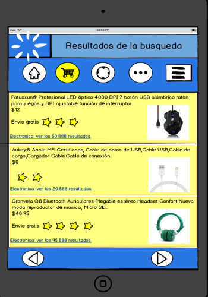

2. El ejemplo muestra una aplicación para realizar compras de contenido
   musical se despliega un número limitado de resultados y si el usuario
   necesita cargar más resultados para encontrar el álbum de su
   elección.

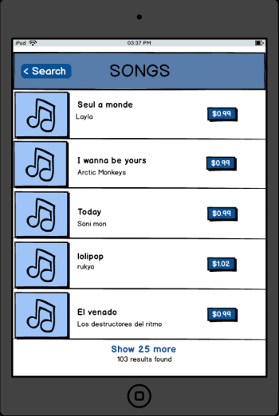

Text Clear Button (Botón de limpieza de texto)
----------------------------------------------

Este patrón está asociado al patrón-clear Entry, los cuales permiten al
usuario remover fácilmente un campo de texto previamente cargado y
evitar la tediosa tarea de borrar letra por letra una cadena de texto.

Borra de un campo de texto con sólo pulsar un botón, típicamente se
posiciona una "X" o un botón de "clear" cerca del campo de texto
permitiéndole al usuario borrar cuando sea necesario.(Ribeiro,2015).

Características
~~~~~~~~~~~~~~~

-  Sencillo de usar
-  Fácilmente reconocido
-  Proporcionar un botón que resetea un campo de texto si se necesita en
   la interfaz móvil.

Ventajas
~~~~~~~~

Ayuda al usuario a borrar de manera sencilla y fácil un campo de texto.

Desventaja
~~~~~~~~~~

No tiene una opción de poder deshacer la acción.

Ejemplos
~~~~~~~~

1. se presenta una simple aplicación que solicita los datos del usuario
   para poder ingresar, si el usuario de equivoca a la hora de
   introducir los datos, fácilmente puede presionar el botón que
   limpiara el campo de texto y podrá continuar ingresando los nuevos
   datos,

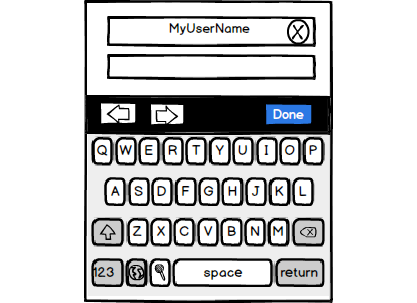

2.El ejemplo presenta una simple búsqueda que el usuario puede realizar
digitando la palabra que necesite buscar, si desea buscar otra cosa,
puede seleccionar el botón con la equis(x) y esto limpiara el campo de
texto para iniciar una nueva búsqueda.

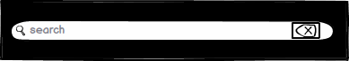

Richly Connect Apps (Aplicaciones conectadas)
---------------------------------------------

Dispositivos móviles no puede mezclar arbitrariamente pequeñas
cantidades de información de una aplicación a otra, es por esto que es
necesario apoyar a la aplicación móvil moviendo los datos de forma
automática.

Al utilizar un dispositivo móvil el usuario solo puede visualizar una
aplicación a la vez, es por esto que dentro de la aplicación móvil se
utilizan enlaces directos a otras aplicaciones. Para esto se necesita en
la aplicación realizar un seguimiento de los datos que podrían ser
estrechamente relacionado con otras aplicaciones y de esta manera cuando
se seleccione y el usuario sea redirigido a otras aplicaciones o
servicios pueda utilizar pueda manejar los datos ahí.

Características
~~~~~~~~~~~~~~~

-  El usuario puede ver múltiples aplicaciones móviles a la vez.
-  Es capaz de realizar varias tareas dentro del contexto de una misma
   aplicación.
-  Se utiliza cuando se necesitan recursos dentro de la aplicación,
   tales como una cámara o la localización.

Ventajas
~~~~~~~~

Elimina la necesidad d cambiar de aplicaciones para realizar distintas
tareas.

Desventaja
~~~~~~~~~~

Al estar directamente conectas los recursos con la aplicación, se puede
cargar material que no se deseaba inicialmente.

Ejemplos
~~~~~~~~

1. la aplicación representada utiliza el patrón de aplicaciones
   conectadas para obtener la información de la ubicación de usuario,
   esto sin la necesitas de salir de la app actual.

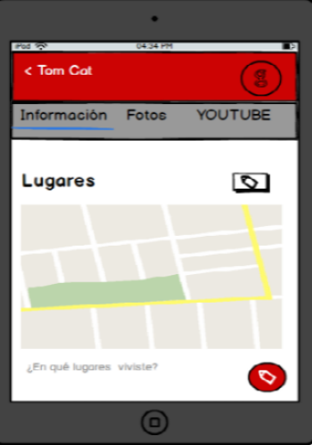

2. En este segundo ejemplo se utiliza el patrón de aplicaciones
   conectadas para desde una aplicación de contenido social se puede
   acceder a la cámara para tomar una foto y cargarla al sitio si así se
   desea, o bien acceder a la galería del teléfono y cargar la imagen
   desde ahí.

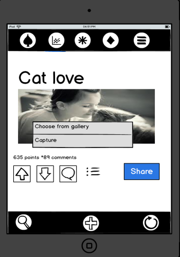

Vertical Stack - Pila vertical
------------------------------

Ordena el contenido de la página móvil en una columna vertical,
permitiendo que haya únicamente desplazamiento hacia abajo. También es
llamado lista vertical.

Características
~~~~~~~~~~~~~~~

Este patrón se debe usar cuando se diseñan páginas web para dispositivos
móviles de distintos tamaños, especialmente si el contenido está basado
en texto y formularios. No es recomendable para aplicaciones residentes
del dispositivo ya que se puede pasar de una página a otra casi
instantáneamente, por otro lado las páginas web necesitan de cierto
tiempo para cargarse. Por lo general los vídeos y juegos tienen un tipo
de desplazamiento diferente y no utilizan este patrón.

Los dispositivos móviles tienen diferentes tamaños de ancho, por lo que
cuando se realiza un diseño de anchura fija que es muy grande para la
pantalla del dispositivo se debe desplazar hacia los lados para poder
ver el contenido, pero este tipo de diseño nunca será tan usable ni
recomendable como permitir al usuario simplemente desplazarse hacia
abajo en la página.

Se recomienda poner los ítems más importantes en la parte superior de la
página web para que sean más visibles para los usuarios, y los ítems
menos importantes en la parte inferior de la página. Se debe evitar
colocar logos, anuncios o barras de herramientas muy grandes en la parte
superior debido a que esto empuja la información importante hacia abajo.
Además, en los formularios se deben colocar las etiquetas sobre los
campos de entrada para ahorrar espacio horizontal.

Ventajas y desventajas
~~~~~~~~~~~~~~~~~~~~~~

Es preferible el desplazamiento vertical en una página web móvil muy
larga, que tener que esperar tiempos de descarga al pasar de una página
a otra. Por esto, una de las principales ventajas de utilizar el diseño
pila vertical es el ahorro de tiempo. Además, la forma en que el
contenido de la página esta organizado permite captar mejor el interés
de los usuarios al tener lo más importante al inicio de ésta. Sin
embargo, dependiendo del largo de la página web se podría considerar una
desventaja cuando lo que le interesa al usuario se encuentra en la parte
final de la página y se ve obligado a desplazarse para poder
encontrarlo.

Ejemplos
~~~~~~~~

En el siguiente bosquejo se muestra el diseño de la página web móvil de
Yahoo!. Primero se muestra un carrusel de imágenes con las noticias más
importantes que le pueden interesar al usuario. Luego se muestran otros
datos como la ciudad donde esta el usuario y la temperatura, además de
información acerca de la bolsa de valores. Finalmente se muestra una
lista de noticias con los titulares y una imagen donde el usuario se
puede desplazar hacia abajo para verlas. El desplazamiento hacia los
lados no es necesario.

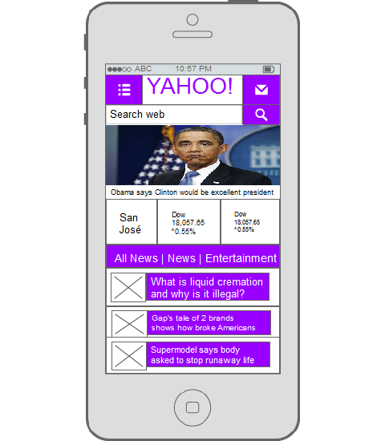

En este otro ejemplo se aplica el mismo patrón, al inicio de la página
se muestra el título de una noticia importante seguido de una imagen y
una breve descripción de la misma. Conforme el usuario se desplaza hacia
abajo podrá diferentes secciones con tipos de noticias, por ejemplo las
principales noticias, selección del editor, entre otras.

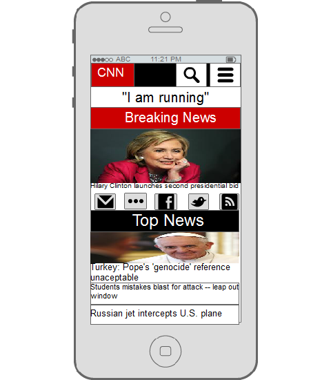

Touch Tools - Herramientas táctiles
-----------------------------------

Se muestran las herramientas solo cuando se toca la pantalla o se
presiona una tecla, las herramientas aparecen en una forma dinámica
sobre el contenido y desaparecen después de un tiempo determinado.

Características
~~~~~~~~~~~~~~~

Es recomendable utilizar este patrón cuando se diseñan aplicaciones que
ocupan la pantalla completa del dispositivo, como por ejemplo vídeos,
imágenes, juegos, mapas y libros. Este tipo de contenido necesita
herramientas o controles de navegación, multimedia, información del
contenido, etc.

Cuando el contenido de una aplicación utiliza este patrón se muestra
directamente en pantalla completa y sin adornos. Es importante resaltar
que también existen aplicaciones que dependiendo de la región de la
pantalla donde se toque pueden aparecer diferentes tipos de herramientas
o no aparecer ninguna debido a que pudo haber sido un toque accidental
del usuario.

Las herramientas y controles se deben mostrar en un área pequeña y
translúcida que parezca como si estuviera flotando sobre el contenido.
Luego de varios segundos o con otro toque de pantalla las herramientas
deberían desaparecer.

Ventajas y desventajas
~~~~~~~~~~~~~~~~~~~~~~

En un diseño móvil el espacio y la atención del usuario son recursos
sumamente importantes, por esto la idea de este patrón es que el usuario
no se distraiga viendo los controles o herramientas que podrían desviar
la atención del contenido y además ocupan espacio en la pantalla. El
usuario puede escoger cuando quiere ver las herramientas o cuando no.

Ejemplos
~~~~~~~~

La siguiente imagen representa el reproductor de música de un teléfono
móvil Android Galaxy Ace, donde al tocar la pantalla se muestran los
controles para retrasar, reproducir, adelantar o cambiar a un orden
aleatorio las canciones. Para que los controles se vuelven a esconder se
debe tocar otra vez la pantalla.

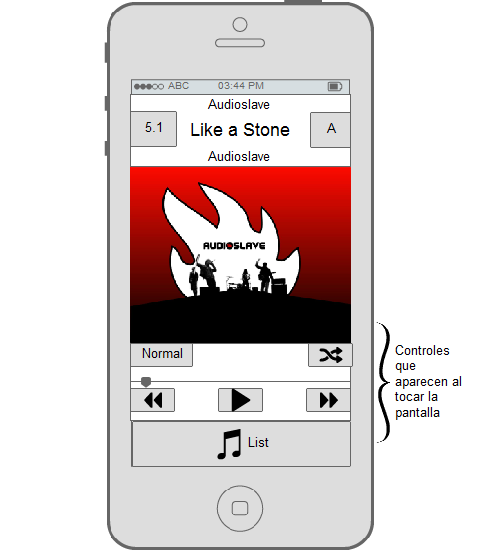

Este bosquejo muestra el visualizador de imágenes de un teléfono móvil
Android Galaxy Ace, la imagen se muestra en pantalla completa y sin
ningún adorno sobre ella, pero al presionar la pantalla se van a mostrar
herramientas para aumentar o disminuir el zoom, un menú para compartir o
borrar la imagen y otra opción para ver todas las imágenes en forma de
presentación.

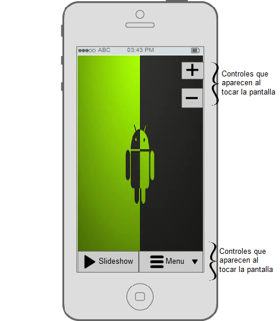

Thumbnail and Text List - Lista de miniaturas y texto
-----------------------------------------------------

Presenta una lista de ítems seleccionables, donde cada ítem cuenta con
una imagen pequeña, texto y también puede incluir iconos pequeños que
representan ciertos detalles del ítem.

Características
~~~~~~~~~~~~~~~

El patrón es muy utilizado cuando se necesita mostrar listas de
artículos, listas de contactos, entradas de blogs, vídeos, aplicaciones
u otro tipo de contenido complejo.

Usualmente la imagen se coloca al lado izquierdo del texto. También se
pueden colocar otros marcadores visuales como las estrellas de
calificación. En un contexto móvil se recomienda usar colores brillantes
y llamativos, esto debido a las pantallas pequeñas manejan mejor colores
fuertes que las pantallas grandes. En este patrón cada línea de la lista
debería ser seleccionable, por lo que no solo la imagen o el título del
ítem servirían como enlaces.

Ventajas y desventajas
~~~~~~~~~~~~~~~~~~~~~~

Las imágenes pequeñas dentro de las listas mejoran la apariencia, ayudan
a una mejor identificación del ítem y brindan una altura apropiada para
el tamaño de cada ítem. Al mejorar la diferenciación entre los
componentes de la listas los usuarios pueden explorar y analizar de una
manera más rápida y fácil.

Actualmente este diseño es uno de los más utilizados para mostrar
diferentes tipos de contenidos, muchos sitios web lo usan para presentar
los links a noticias y blogs de forma que se vean mejor y más atractivos
para los usuarios.

Ejemplos
~~~~~~~~

En el siguiente ejemplo se muestra la aplicación Play Store de Google
para comprar y descargar otras aplicaciones, juegos, películas, música o
libros. Existen diferentes categorías para descargar aplicaciones, ya
sean gratis o pagadas, pero en todas se utiliza el patrón de lista de
miniaturas y texto. Aquí se puede observar como cada ítem de la lista
tiene una imagen que lo identifica, el nombre de la aplicación, la
compañía que la desarrolló, estrellas de calificación de los usuarios y
un menú para instalar o actualizar.

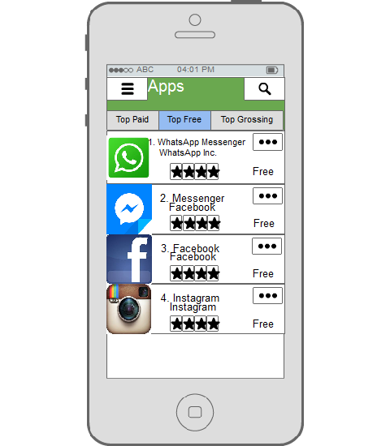

Ésta imagen es similar a la anterior pero muestra la aplicación de
Amazon, cuando se desea buscar un producto se mostrará una lista con una
imagen pequeña, el nombre y la marca del producto, las estrellas de
rating del producto y el precio.

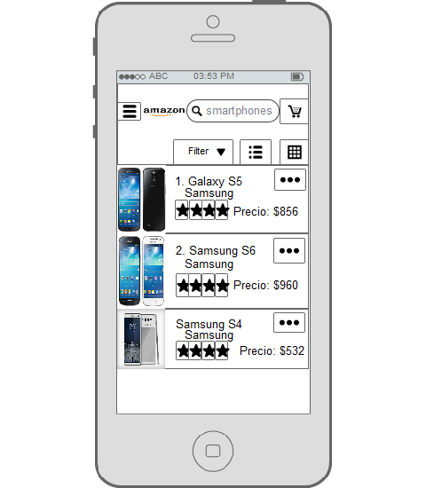

Generous Borders - Bordes generosos
-----------------------------------

El objetivo de este patrón es dejar márgenes grandes y espacios en
blando alrededor de botones, links u otro tipo de control que se pueda
presionar.

Características
~~~~~~~~~~~~~~~

Este patrón es apropiado cuando se necesita utilizar botones con
etiquetas de texto, una lista de ítems, links ordinarios basados en
texto o cualquier objetivo táctil que no sea muy grande en la pantalla.

Por lo tanto, este tipo de componentes táctiles deben ser rodeados con
suficiente margen interno, borde y espacio en blanco para que sean
alcanzados con la punta de los dedos. Una manera de hacer esto es
convertir el espacio en blanco en un objetivo táctil, y con esto se gana
más pixeles de sensibilidad en cada dirección alrededor del botón.

Nunca se debe poner información importante (etiquetas o instrucciones)
debajo de un elemento de la interfaz que puede ser tocado, esto debido a
que la información puede ser tapada por la misma mano o el brazo del
usuario al tratar de presionar el objetivo.

Todavía no existe un consenso sobre el tamaño ideal para los objetivos
táctiles, pero en libro Designing Gestural Interfaces se menciona la
siguiente fórmula: Objetivo = (tamaño en pulgadas del objetivo) \*
(ancho de la pantalla en píxeles) / (tamaño de la pantalla en pulgadas).
En este mismo libro se menciona la técnica de la "punta del iceberg"
(iceberg tips), de esta manera los objetivos tienen un área táctil más
grande de lo que se ve.

Ventajas y desventajas
~~~~~~~~~~~~~~~~~~~~~~

Con este patrón se pretende que los objetivos táctiles sean los
suficientemente grandes para ser alcanzados por "dedos torpes", que
suele ser difícil con botones o links que consisten solamente de texto.

Usando "iceberg tips" se puede aumentar el tamaño del objetivo tocable
sin necesidad de aumentar el tamaño del botón u otro tipo de componente,
con esto se evita tener botones de diferentes tamaños en la interfaz.

Ejemplos
~~~~~~~~

El siguiente ejemplo es una aplicación llamada "Water Your Body",
utilizada para recordar al usuario beber agua cada cierto tiempo y
llevar un registro de hábitos al beber agua. En esta aplicación podemos
ver botones grandes con suficiente espacio en blanco y dejando márgenes
que facilitan al usuario presionarlos.

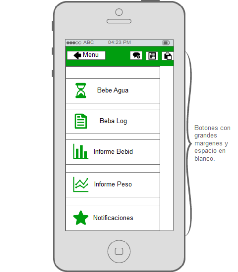

La siguiente imagen es de una aplicación llamada "Clean Master" la cual
utiliza este patrón de bordes generosos para algunos botones. Como se
puede ver en la imagen cada botón cuenta con márgenes grandes que
también cuentan como área táctil.

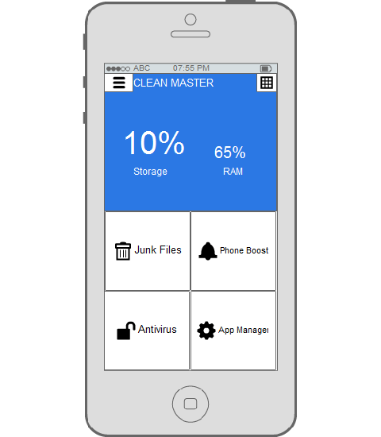

Loading Indicators - Indicadores de carga
-----------------------------------------

Mientras una página o una sección de la página se carga se debe mostrar
un indicador del progreso en lugar donde aparecerá el contenido.

Características
~~~~~~~~~~~~~~~

Se debe implementar este patrón cuando un usuario tiene que esperar
cierto tiempo mientras el contenido o una parte específica de la
aplicación se carga, especialmente si la página cambia dinámicamente
como respuesta a una acción del usuario.

Cargar nuevo contenido en una página web de un dispositivo móvil o una
aplicación con conexión a internet puede ser lento y fallido, por esto
siempre se debe mostrar el progreso de la carga de la página de modo que
sea útil para el usuario. Conforme el contenido se va descargando, este
se debe ir mostrando los más rápido posible.

Ventajas y desventajas
~~~~~~~~~~~~~~~~~~~~~~

Los indicadores de progreso hacen parecer que el tiempo pasa más rápido
para el usuario y muestran que algo está pasando en respuesta a una
acción.

Ejemplos
~~~~~~~~

En la aplicación de Facebook para dispositivos móviles se utiliza este
patrón cuando se quiere actualizar los posts que han hecho otras
personas. Al presionar la pantalla y deslizarla hacia abajo aparecerá un
indicador de carga mientras se actualiza.

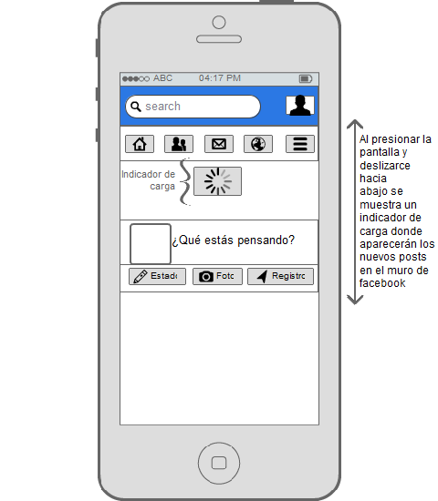

Este patrón también se utiliza en la aplicación de Youtube, mientras se
carga el video aparecerá un indicador y de la misma forma se utiliza
cuando se desean ver los comentarios que han hecho otros usuarios sobre
el video.

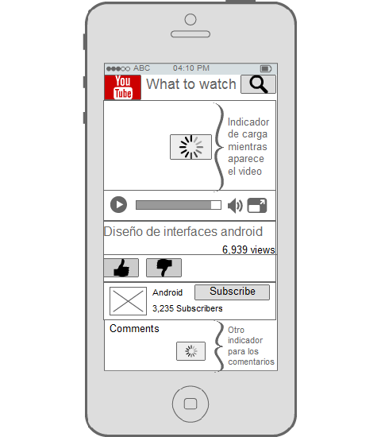

Streamlined Branding - Racionalización de marca
-----------------------------------------------

Al usar el logo, los colores u otros elementos de la marca de la
organización en una aplicación o sitio web móvil se deben mantener
pequeños y que sean rápidos de cargar.

Características
~~~~~~~~~~~~~~~

Todas las compañías que tengan un sitio web y pretendan crear una
aplicación móvil deberían utilizar este patrón de diseño. Lo usuarios
deben ser capaces de identificar a quien pertenece la aplicación o sitio
web.

Las pantalla móviles no tienen mucho espacio por lo que estas imágenes
deben ser pequeñas, las conexiones de red en móviles suelen ser más
lentas, por esto las imágenes no pueden ser muy pesadas ni muy grandes
de modo que no ocupen mucho espacio en la interfaz.

Se debe considerar crear diferentes versiones de la imagen de la marca o
el logo para los diferentes tamaños de dispositivos móviles. Los colores
de la marca y el tipo de letra se pueden aplicar para el diseño de la
aplicación móvil. De este modo se verá mucho más profesional y con un
mejor aspecto.

Al diseñar un sitio web o aplicación para móviles se debe tener en
cuenta que el usuario podría utilizarlo en condiciones difíciles, como
por ejemplo cuando no hay suficiente luz, cuando se va en vehículo en
movimiento o hay otro tipo de distracciones. Por esto siempre se debe
diseñar con el texto lo más legible posible, los colores adecuados y
adaptar el logo o ciertos detalles de la marca a la plataforma que se va
a utilizar.

Ventajas y desventajas
~~~~~~~~~~~~~~~~~~~~~~

En estudios de usabilidad las personas responden bien al ver marcas
confiables y familiares para ellos. Esto permite que los usuarios se
sientan seguros al utilizar aplicaciones asociadas a compañías de donde
son clientes.

Ejemplos
~~~~~~~~

En este ejemplo podemos ver como Intel adapta el logo y los colores de
su marca para que se adapten dependiendo del dispositivo de donde de
acceda, en la primera imagen vemos como se vería desde un teléfono móvil
donde las imágenes son más pequeñas para que se carguen más rápido. En
la segunda imagen es la vista desde una ventana en un browser
(navegador) donde se cuenta con más espacio para las imágenes.

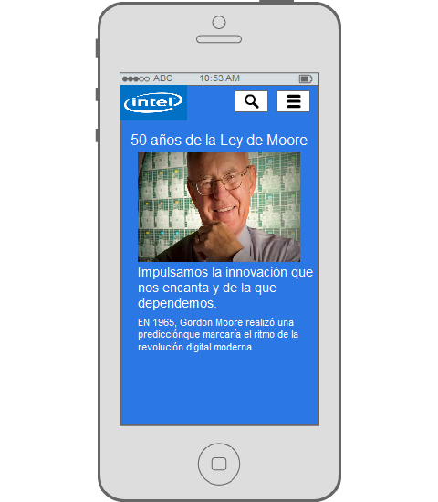

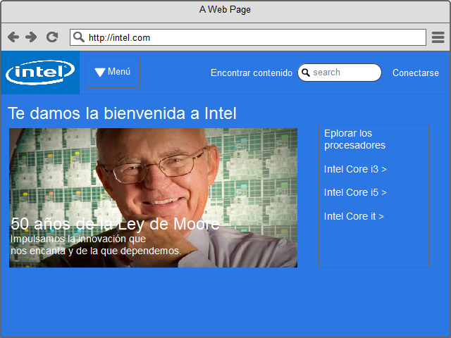

De igual manera en el siguiente ejemplo se muestra una comparación entre
la vista del sitio web de Microsoft desde un navegador y un teléfono. En
ambos ejemplos se trata de utilizar las mismas imágenes y colores, para
que de esta manera resultan familiares para los usuarios sin importar el
medio que se utilice para verlas

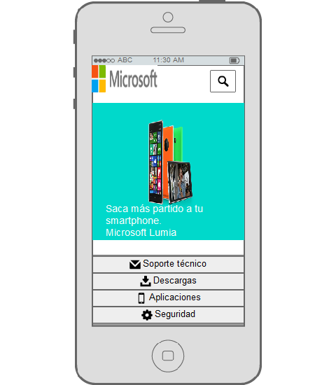

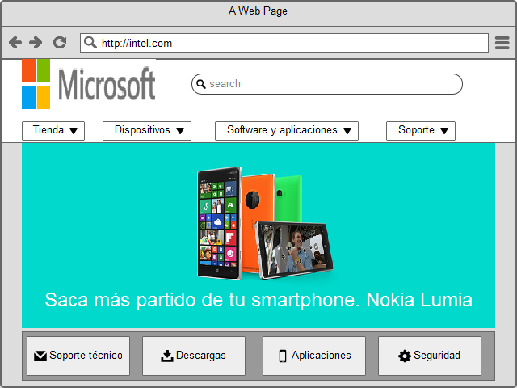

Referencias bibliográficas
--------------------------

-  Tidwell, Jenifer. (2011). Designing Interfaces, Capítulo 10.
   O’Reilly.

-  Hoober, S., Berkman, E. (2011). Designing Mobile Interfaces. O'Reilly
   Media, Inc.

-  Neil, Teresa. (2012). Mobile Design Pattern Gallery. O'Reily.

-  Saffer, Dan. (2008). Designing Gestural Interfaces: Touchscreens and
   Interactive Devices, Capítulo 2. O'Reilly Media, Inc.

-  UIPatterns. Design Patterns. Consultado el 15 de abril de 2015,
   disponible en: http://ui-patterns.com/patterns

-  4ourth mobile Patterns Wiki.Consultado el 9 de abril del 2015,de:
   `Film strip/patterns. <http://4ourth.com/wiki/Film%20Strip>`__

-  Ribeiro, J.,(2015)Design Patterns. Consultado el 9 de abril del
   2015,de: `Clear
   Entry <http://patterns.jribeiro.org/patterns/clear-entry>`__

